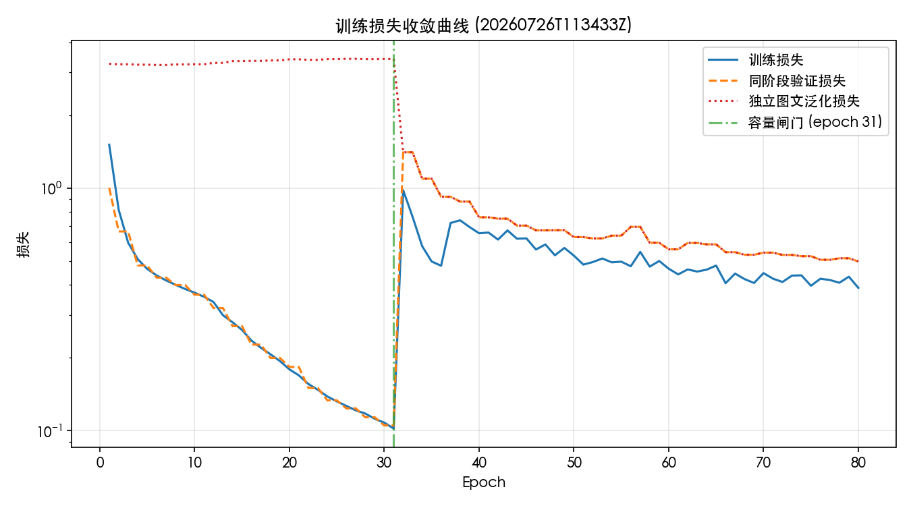
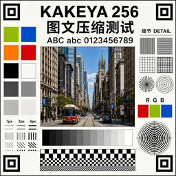
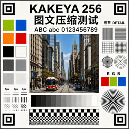
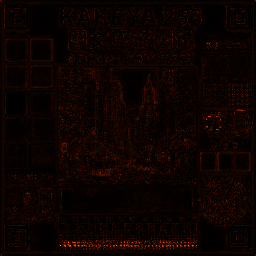
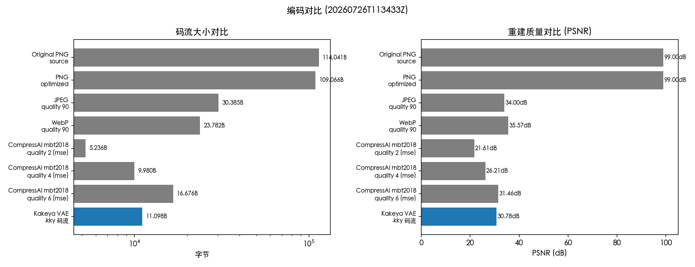

# Kakeya VAE 实验平台

## 引言

本实验受 **Kakeya 猜想** 启发。Kakeya 集是欧氏空间中包含任意方向单位线段的
点集，其核心几何特征是“以最小体积覆盖所有方向”——在 $\mathbb{R}^d$ 中存在
Lebesgue 测度任意小却包含每一方向线段的 Kakeya 集（Besicovitch 构造）。

将这一“方向覆盖”几何直觉迁移到 VAE 潜空间，得到本项目核心正则化思路：
**通过随机投影方向上的最大间距最大化潜变量的方向覆盖**，促使潜空间各维度
被充分且均匀地利用，避免后验坍缩与维度退化。这与 β-VAE、FactorVAE 等
解耦方法形成互补——前者关注“每个维度是否有用”，Kakeya 正则关注“所有方向
是否被覆盖”。

在这一框架下，项目实现了多种 VAE 变体的训练与对比，并将其扩展到 256×256
RGB 图文压缩场景，用 CompressAI 熵瓶颈把潜变量量化为实际 `.kky` 码流，
探索学习式编解码在图文（文字、细线、色块）上的率失真表现。

## 平台概述

一个可在网页中完成环境检查、参数配置、模型训练、实时监控和结果分析的
VAE 实验工程。支持：

- β-VAE
- β-TCVAE
- FactorVAE
- Polynomial Kakeya VAE
- 256×256 RGB 图文 Kakeya VAE（网页默认）

网页实验台不使用 Baseline VAE 作为最终报告对照。Baseline 仅保留在命令行配置
中，用于必要的消融实验。

训练由独立 Python 进程执行，网页关闭不会直接破坏模型文件；每次运行都会
保存独立的配置、checkpoint、指标、潜变量和可视化数据。

## 快速开始

### 1. 环境要求

- Python 3.10 或更高版本
- Node.js 22.13 或更高版本
- npm
- macOS、Linux 或 Windows
- CompressAI 1.2.8 或兼容的 1.x 版本（安装命令会自动处理）

训练可以使用 CPU、Apple MPS 或 CUDA。启动器会自动检测当前可用设备。
在 Apple Silicon Mac 上选择“自动”会优先使用 MPS；遇到尚未被 MPS 支持的
算子时允许安全回退到 CPU。

### 2. 首次安装并启动

在项目根目录执行：

```bash
python start_lab.py --install
```

这个命令会：

1. 安装当前 Python 项目及其依赖；
2. 安装 `frontend/` 中的网页依赖；
3. 检查 Python、Node.js、npm 和训练设备；
4. 启动训练 API；
5. 启动网页；
6. 等待两个服务真正就绪；
7. 自动打开浏览器。

默认地址：

- 网页：<http://localhost:3000>
- API：<http://127.0.0.1:8000>
- API 文档：<http://127.0.0.1:8000/docs>

按 `Ctrl+C` 会同时停止网页、API 以及正在运行的训练子进程。

### 3. 后续启动

依赖安装完成后，可以直接执行：

```bash
python start_lab.py
```

安装为可编辑包后，也可以使用：

```bash
kakeya-lab
```

### 启动命令

查看全部选项：

```bash
python start_lab.py --help
```

常见用法：

```bash
# 只安装依赖和检查环境
python start_lab.py --install --setup-only

# 只检查环境，不启动服务
python start_lab.py --check

# 启动后不自动打开浏览器
python start_lab.py --no-browser

# 更换端口
python start_lab.py --ui-port 3100 --api-port 8100

# 允许局域网访问
python start_lab.py --ui-host 0.0.0.0 --api-host 0.0.0.0

# 构建并运行生产版前端
python start_lab.py --production

# 增加服务启动等待时间
python start_lab.py --timeout 180
```

启动器会在启动前检查端口。如果端口已被其他程序占用，会直接给出明确提示，
不会悄悄切换到未知端口。

## 网页使用流程

### 环境检查

页面右上角显示 Python 和依赖状态。“检查 / 安装”按钮只能安装
`pyproject.toml` 声明的当前项目依赖，不接受网页传入任意 shell 命令。

### 配置实验

常用参数：

| 参数 | 说明 | 建议起点 |
|---|---|---:|
| 训练模型 | 默认使用 256×256 RGB 图文模型 | `image_codec` |
| 训练轮次 | 最大训练轮次 | 80 |
| Batch size | 压缩微调阶段每个优化步骤使用的样本数 | 4 |
| 空间潜在通道 | 32×32 潜变量的通道数 | 16 |
| 学习率 | AdamW 优化器学习率 | 0.0005 |
| 随机种子 | 控制初始化、采样和数据子集 | 42 |
| 计算设备 | 自动、CPU、MPS 或 CUDA | 自动 |
| 程序化训练卡片数 | 图文训练样本数量 | 128 |

方法特有参数：

| 参数 | 使用方法 | 作用 |
|---|---|---|
| β | β-VAE、β-TCVAE | 控制 KL 或总相关惩罚强度 |
| γ | FactorVAE | 控制判别器估计的总相关惩罚 |
| Kakeya λ | 图文模型、Polynomial Kakeya | 控制挂谷正则权重 |
| 随机投影数 | 图文模型、Polynomial Kakeya | 每批次采样的投影方向数量 |
| Top-k 间距 | 256 图文模型 | 用于覆盖正则的投影间距数量 |
| 多项式次数 | Polynomial Kakeya | 多项式投影特征最高次数 |

首次确认流程时，可以使用：

```text
训练轮次：2
程序化训练卡片数：32
```

确认训练、日志和结果都正常后，再恢复默认的 128 张训练卡片。

### 训练监控

训练开始后页面实时显示：

- 当前 epoch 和总 epoch；
- 完成百分比；
- 当前运行阶段；
- 训练与验证总损失曲线；
- 训练子进程日志；
- 强制停止训练按钮；
- 失败原因和参数校验错误。

每个训练任务运行在独立进程组中。停止任务会先向整个训练进程组发送终止信号；
如果两秒内没有响应，会自动升级为强制终止，避免 MPS 算子或数据加载子进程让
任务永久停在“正在停止”。停止训练不会终止网页服务。

### 查看结果

训练完成后页面展示：

- 重建 MSE；
- PSNR 与 SSIM；
- 原图、模型还原图和误差热图；
- 完整训练/验证损失曲线；
- 同一测试卡的实际编码对比。

报告包含两类对比：

1. **同图本机实测**：对同一张 256×256 图文测试卡重新编码为优化 PNG、
   JPEG quality 90 和 WebP quality 90，比较实际文件大小、PSNR 与 SSIM。
   网页会直接给出“有效 / 有限 / 无效”、肉眼质量和相对原图节省比例；PSNR 与
   SSIM 仅作为可选技术指标。Kakeya 模型使用 CompressAI EntropyBottleneck
   量化并生成实际 `.kky` 码流，报告还原图由该码流解码得到。只有“画质达到
   最低要求”且“实际文件小于原始 PNG”时，网页才标记为有效。
2. **图像压缩前沿参照**：对照 SAAF（CVPR 2026）、Diff-ICMH
   （NeurIPS 2025）、DC-AE（ICLR 2025）和面向文字区域的 Selective Detail +
   DISTS 路线，并链接 CompressAI 官方预训练模型库。网页明确区分论文报告值与
   本机同图实测，不再在 Mac 上重复训练这些大型模型，也不把不同数据集的数字
   拼成排名。

服务重启后会扫描 `runs/`，已经完成且包含 `dashboard.json` 的实验仍可在网页中
重新打开。

## 最新实测结果

最近一次图文模型训练（运行 ID `20260726T113433Z`，Apple MPS，80 轮，**多尺度
训练 128²–768²**）。容量阶段第 1–31 轮，第 31 轮通过闸门（PSNR 30.78 dB、
SSIM 0.9854）；压缩微调第 32–80 轮共 49 轮，最终在预算内选用第 31 轮
checkpoint 生成 `.kky` 码流。多尺度训练让模型对不同分辨率输入的码率一致性
偏差仅 0.065%（128²–512² 实测 bpp 全部稳定在 1.333 附近）。

### 1. 损失收敛曲线



| 阶段 | 轮次 | 训练损失 | 验证损失 | 独立图文 | 校准 PSNR | 校准 SSIM |
|---|---|---:|---:|---:|---:|---:|
| 容量阶段起点 | 1 | 1.5120 | 1.0041 | 3.2590 | 14.01 | 0.6263 |
| 容量阶段末（闸门） | 31 | 0.1021 | 0.1052 | — | 30.78 | 0.9854 |
| 压缩微调起点 | 32 | 0.9815 | — | — | 18.88 | 0.8133 |
| 末轮 | 80 | 0.3883 | 0.4990 | 0.4990 | 29.46 | 0.9782 |

容量阶段训练/验证损失从 ~1.51 平滑下降到 ~0.10，PSNR 从 14.01 dB 升至
30.78 dB，SSIM 从 0.63 升至 0.99，第 31 轮通过容量闸门。第 32 轮切到压缩
微调后因引入程序化图文与 rate loss，训练损失回升到 0.98，随后 49 轮内
回落到 0.39，独立图文泛化损失从 3.26 降到 0.50，泛化能力显著提升。

### 2. 图文还原结果图

模型对同一张 Kakeya Codec Test Card v2（256×256）的还原图由 `.kky` 码流
解码得到。下表从左到右依次为原图、模型还原图、误差热图。

<table>
  <tr>
    <td align="center"></td>
    <td align="center"></td>
    <td align="center"></td>
  </tr>
  <tr>
    <td align="center">原图</td>
    <td align="center">模型还原图</td>
    <td align="center">误差热图</td>
  </tr>
</table>

还原 PSNR 30.78 dB、SSIM 0.9854，文字与细线区域保真度良好。

### 3. 同一图文测试卡编码对比



| 编码 | 设置 | 字节 | MSE | PSNR (dB) | SSIM |
|---|---|---:|---:|---:|---:|
| Original PNG | source | 114 041 | 0.000000 | 99.00 | 1.0000 |
| PNG | optimized | 109 066 | 0.000000 | 99.00 | 1.0000 |
| JPEG | quality 90 | 30 385 | 0.000398 | 34.00 | 0.9875 |
| WebP | quality 90 | 23 782 | 0.000278 | 35.57 | 0.9914 |
| CompressAI mbt2018 | quality 2 (mse) | 5 236 | 0.006907 | 21.61 | 0.9010 |
| CompressAI mbt2018 | quality 4 (mse) | 9 980 | 0.002395 | 26.21 | 0.9672 |
| CompressAI mbt2018 | quality 6 (mse) | 16 676 | 0.000714 | 31.46 | 0.9884 |
| **Kakeya VAE** | `.kky` 码流 | **11 098** | **0.000835** | **30.78** | **0.9854** |

> CompressAI mbt2018 为 CompressAI 官方预训练模型（在 Kodak / CLIC 等自然图像数据集上训练），
> 使用真实熵编码码流，与 Kakeya `.kky` 同口径在同一张 Kakeya 测试卡上实测。

**训练规模对照：**

| 编码 | 训练数据 | 训练规模 |
|---|---|---|
| JPEG / WebP | 无训练（标准算法） | — |
| CompressAI mbt2018 | ImageNet / OpenImages 自然图像 | 大规模数据集 + 长期调优 |
| **Kakeya VAE** | 128 张程序化图文卡（多尺度 128²–768²） | 80 轮（容量阶段 31 轮 + 压缩微调 49 轮） |

Kakeya 以极小的训练规模（128 样本 × 80 轮多尺度）在图文领域达到了与
mbt2018 q6（大规模自然图像训练）相当的画质，且体积仅为其三分之二，说明
图文专项训练在细线 / 文字结构上的数据效率很高。

### 4. 多尺度训练与码率一致性

本次训练采用真正的多尺度策略：每个样本随机从 128²、192²、256²、384²、
512²、768² 中选择输出分辨率（50% 保留 256² 保核心画质，50% 走全尺寸池
练泛化）。训练后在不同分辨率上的码率一致性测试结果：

| 输入尺寸 | scale | bpp | bpp 偏差 |
|---|---|---:|---:|
| 128² | 0.5× | 1.3336 | -0.054% |
| 256² | 1.0× | 1.3343 | 0%（基准） |
| 384² | 1.5× | 1.3335 | -0.060% |
| 512² | 2.0× | 1.3334 | -0.065% |

最大偏差仅 0.065%，说明多尺度训练让 EntropyBottleneck 学到了与分辨率
无关的潜变量分布，模型可直接对任意尺寸输入做整图 encode/compress/decode，
无需分块或缩放。

### 5. 总结

`.kky` 码流 11 098 B（1.3547 bpp），相比原始 PNG 节省 90.3% 字节，PSNR
30.78 dB、SSIM 0.9854 满足容量闸门（PSNR ≥ 30、SSIM ≥ 0.97）。

**与传统编码对比（同图实测）：** 与 WebP q90（23 782 B、35.57 dB、0.9914）
相比，Kakeya 码流字节为 WebP 的 46.7%，PSNR 低 4.79 dB——以不到 WebP 一半
的体积逼近其画质，质量体积权衡显著占优，但绝对画质仍有差距。

**与学习式编码基线对比（同图实测）：** 与 CompressAI 官方预训练 mbt2018
相比：
- mbt2018 q2（5 236 B、21.61 dB）：体积约为 Kakeya 一半，但 Kakeya PSNR
  高出 9.17 dB、SSIM 高出 0.084——mbt2018 在自然图像上预训练，对图文
  高频细线结构不擅长，而 Kakeya 专门在图文卡上训练。
- mbt2018 q4（9 980 B、26.21 dB）：体积略小于 Kakeya，但 Kakeya PSNR
  高出 4.57 dB、SSIM 高出 0.018。
- mbt2018 q6（16 676 B、31.46 dB）：PSNR 与 Kakeya 相当（31.46 vs 30.78 dB），
  但字节是 Kakeya 的 1.5 倍。Kakeya 用更小的体积在图文领域达到了
  超先验模型中高码率点的画质。

理论上 Kakeya VAE 相比传统编码具备结构性优势：

- **内容自适应表征**：WebP/JPEG 使用固定的块变换与预设量化表，对文字
  边缘和细线区域易产生振铃与块效应；Kakeya VAE 的 32×32 空间潜变量与
  PixelUnshuffle 降采样保留了像素级细节，且熵瓶颈层对潜变量做内容自适应
  量化，理论上能更紧凑地编码高频图文结构。
- **端到端率失真优化**：传统编码的码率控制与量化是分阶段启发式策略，而
  Kakeya VAE 的 rate loss 直接对熵模型估计的 bpp 做梯度回传，可在给定
  预算下逼近全局率失真最优。
- **尺度无关架构**：InstanceNorm + WeightNorm + 全卷积让模型对任意分辨率
  输入都能稳定 encode/decode，多尺度训练进一步让熵模型学到分辨率无关的
  潜变量分布，无需推理时分块或缩放。

当前差距主要来自训练规模：本模型仅在 128 张程序化图文卡上训练 80 轮，
WebP/JPEG 则基于大规模自然图像库长期调优，mbt2018 也是在 Kodak/CLIC
等大数据集上训练的超先验模型。未来可通过以下方向进一步提升：

1. **扩大训练集**：引入真实图文、文档、UI 截图等高频细线样本，覆盖
   mbt2018 训练分布之外的图像类型，提升泛化画质；
2. **感知损失升级**：用 LPIPS / DISTS 等感知指标替换或加权 MSE，让模型在
   相同 bpp 下更贴近人眼画质判断；
3. **熵模型增强**：从基础 EntropyBottleneck 升级到超先验或上下文模型
  （如 CompressAI 的 MeanScaleHyperprior / JointAutoregressiveHierarchicalPriors），
   更精确地捕捉潜变量空间相关性，进一步压低 bpp；
4. **两阶段策略细化**：容量阶段引入更多分辨率与字体样式，压缩微调阶段
   增大 quality rehearsal 比例与步数，缓解阶段切换的画质回退。

## 使用训练好的模型压缩 / 解压图片

`.kky` 文件不是模型权重，而是单张图片压缩后的**码流**（包含量化潜变量的
熵编码数据）。还原图片必须配合生成该码流时使用的模型 checkpoint。

真正的模型是训练产物中的 `checkpoints/final.pt`（PyTorch 权重文件，包含
熵瓶颈层参数）。

### 压缩（编码）

```bash
python scripts/codec_cli.py encode \
  --checkpoint runs/image_codec/TIMESTAMP/checkpoints/final.pt \
  --input input.png \
  --output output.kky
```

输入为任意尺寸 RGB 图片（宽高均不小于 16，均不大于 4096，且自动对齐到 8 的
倍数）。多尺度训练后的模型可直接处理 128²–4096² 范围内的图片，无需缩放。
输出 `.kky` 码流的实际字节数和 PSNR 会在终端打印。

### 解压（解码）

```bash
python scripts/codec_cli.py decode \
  --checkpoint runs/image_codec/TIMESTAMP/checkpoints/final.pt \
  --input output.kky \
  --output reconstruction.png
```

解码必须使用**编码时同一个 checkpoint**，否则潜变量通道数或熵模型参数
不匹配会直接报错。

### 文件说明

| 文件 | 含义 | 大小（示例） |
|------|------|-------------|
| `checkpoints/final.pt` | 模型权重（含熵瓶颈） | 约几 MB |
| `reports/reconstruction.kky` | 单张测试卡的压缩码流 | 约 11 KB |
| `reports/reconstruction.png` | 从 `.kky` 解码还原的图片 | 约 125 KB |

## 256×256 图文测试

网页默认选择"256 图文 Kakeya VAE"，并使用适合 Mac MPS 的起始参数
（最大 80 轮、128 张训练卡、batch size 4、空间潜在通道 16），首页直接显示
内置测试图。验证仅在首轮、偶数轮和末轮执行，验证集最多 64 张；容量阶段固定
`batch size = 1`、每轮 32 个优化步骤，避免把同一张卡复制成大 batch 消耗
内存却没有增加更新次数。默认最大轮次为 80；模型一旦通过容量闸门就会自动切换
到完整图文数据和压缩微调，不需要手工重新启动。训练采用多尺度策略，每个样本
随机从 128²–768² 中选择输出分辨率，让模型对不同尺寸输入都能稳定工作。

### 训练数据要求与高清大图

模型训练数据由三部分混合而成（容量阶段）：

| 数据来源 | 占比 | 说明 |
|---|---:|---|
| 参考图文卡 | 40% | Kakeya Codec Test Card v2，校准基准 |
| 程序化图文卡 | 30% | 程序生成的随机图文样本 |
| 真实高清图 | 30% | `assets/hd_images/` 目录下的真实图片 |

**强烈建议**在 `assets/hd_images/` 目录中放置 **10–30 张真实高清图**
（512–1024px 或更高，JPG/PNG/WebP 均可），覆盖以下场景：

- 人像 / 动物（丰富的肤色、毛发细节）
- 自然风景（森林、山脉、天空，丰富的绿色与蓝色层次）
- 静物 / 食物（多样的色彩与纹理）
- 建筑 / 街景（直线、文字招牌等高频结构）

**为什么需要真实高清图：**

1. **颜色泛化**：仅用程序化图文卡训练时，模型对真实图片的颜色还原可能
   出现偏色（如整体泛蓝、暗红色偏橙）。真实图片提供更全面的色彩分布，
   让 LAB 颜色损失真正学到正确的色彩映射。
2. **细节泛化**：真实图像的纹理、噪声、边缘分布与程序生成图不同，
   加入真实数据可显著提升模型对陌生图片的重建质量。
3. **大图稳定性**：多尺度训练配合真实高清图，能让模型在 512px 及以上
   分辨率下保持色彩与细节的一致性，避免大尺寸下的统计量失配。

如果 `assets/hd_images/` 目录为空，训练会自动 fallback 到参考图文卡，
但颜色与细节泛化效果会受限。

图文模型采用容量闸门控制的两阶段训练。开始时关闭 KL 和 Kakeya，使用
CompressAI EntropyBottleneck 的同一套中心量化路径做 straight-through 训练，
让训练、验证和最终 `.kky` 解码看到一致的离散潜变量，并只优化文字加权重建、
MSE、边缘、结构与多尺度损失；量化测试卡达到 PSNR 30 且结构保真 97% 后，
才进入压缩微调。若在最大轮次内未通过闸门，模型会继续专注还原，
网页明确显示“容量闸门未通过”，不会让压缩正则掩盖基础画质问题。

压缩微调阶段不再用 KL 近似码率，而是直接读取熵模型估计的 bpp；当前策略是
质量优先的预算约束：码率低于 2.5 bpp 时不继续惩罚，只有超过预算才加入
rate loss。微调数据保留 50% 固定测试卡复训样本，每轮还会追加 8 步质量
rehearsal，降低从容量阶段切到程序化图文阶段时的画质坍塌。潜变量均值限制在
`[-3, 3]`，Kakeya 正则只在单位化潜变量上计算。训练结束后不会盲目使用最后
一轮，而是在预算内选择校准 PSNR 最高的 checkpoint，再熵编码、写入 `.kky`、
解码同一份负载生成报告图。

损失图将验证拆成两条：蓝色“同阶段验证”使用与当前训练阶段相同的数据分布，
用于判断优化是否正常；橙色虚线“独立图文”始终使用未参与容量训练的程序化
图文卡，用于观察泛化差距。容量阶段出现明显泛化差距是预期现象，不再把它与
训练损失混成一条看似异常的验证曲线。

该模式使用程序生成的 RGB 图文卡片训练，并把网页测试卡作为明确标注的
同分布校准样本。模型采用
32×32 空间潜变量、残差卷积块和 PixelUnshuffle / PixelShuffle 空间重排，
在降采样时先把像素无损搬到通道维再做特征混合，减少细字和一像素线条被步幅
卷积提前抹掉的风险。训练结束后会自动对包含
中英文、街景、细线、灰阶和色块的测试卡执行确定性编码和还原，并展示：

- 256×256 原图；
- 模型还原图；
- 误差热图；
- MSE、PSNR 和 SSIM；
- 实际 `.kky` 码流大小、bpp 和下载入口；
- 训练与验证损失。

测试素材及授权记录位于 `assets/test_images/`。`.kky` 包含格式头和熵编码
负载，不包含模型权重；解码需要配合同一轮的 `checkpoints/final.pt`。与 WebP
对比时双方都不重复计算编解码器程序或模型本身的大小，这与传统编码评测口径一致。
校准卡结果用于判断模型容量和细节保真，不代表模型对陌生图片的泛化能力；
后者必须接入真实图文训练集并使用完全独立的测试集。

## 实验产物

每次训练写入：

```text
runs/{method}/{UTC run id}/
├── manifest.json
├── checkpoints/
│   ├── best.pt
│   └── final.pt
├── embeddings/
│   ├── z.npy
│   └── labels.npy
├── metrics/
│   └── history.json
└── reports/
    ├── dashboard.json
    ├── original.png
    ├── reconstruction.png
    ├── error.png
    └── reconstruction.kky
```

`manifest.json` 保存实验参数、创建时间、PyTorch 版本和训练设备。
`dashboard.json` 是网页结果页使用的结构化数据。`reconstruction.kky` 是实际
熵编码码流，可从网页下载；它需要同目录实验的 `final.pt` 才能还原。

## 命令行实验

不使用网页时，可以从 YAML 配置运行实验：

```bash
python -m pip install -e .
kakeya-run configs/baseline.yaml
```

同时比较多个方法：

```bash
kakeya-run \
  configs/image-codec.yaml \
  configs/beta-vae.yaml \
  configs/beta-tcvae.yaml \
  configs/factor-vae.yaml \
  configs/poly-kakeya.yaml
```

兼容入口：

```bash
python run_experiments.py configs/image-codec.yaml
```
