# Kakeya Image Codec 架构图

> 文档顺序遵循项目逻辑故事线：**为什么做（挂谷猜想）→ 怎么做（模型/损失/数据/训练）→ 怎么用（推理/API）→ 遇到什么问题（泛化/大图）**

---

## 1. 挂谷猜想 (Kakeya Conjecture) 与潜空间正则化

> 本项目的核心创新。受挂谷猜想启发，通过随机投影方向上的最大间距最大化潜变量的方向覆盖，避免 VAE 后验坍缩。

### 1.1 挂谷猜想的几何直觉

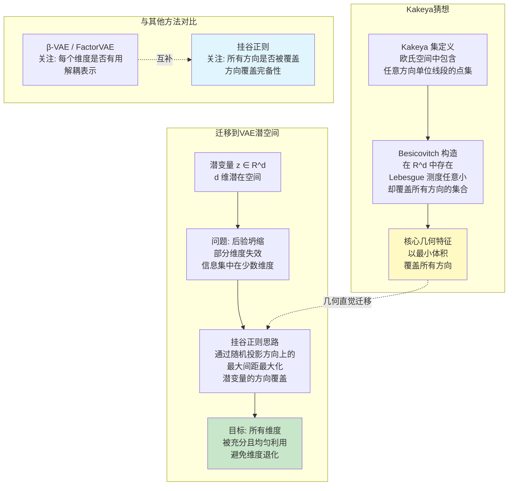
```mermaid
graph TD
    subgraph Kakeya猜想
        K1[Kakeya 集定义<br/>欧氏空间中包含<br/>任意方向单位线段的点集]
        K2[Besicovitch 构造<br/>在 R^d 中存在<br/>Lebesgue 测度任意小<br/>却覆盖所有方向的集合]
        K3[核心几何特征<br/>以最小体积<br/>覆盖所有方向]

        K1 --> K2
        K2 --> K3
    end

    subgraph 迁移到VAE潜空间
        V1[潜变量 z ∈ R^d<br/>d 维潜在空间]
        V2[问题: 后验坍缩<br/>部分维度失效<br/>信息集中在少数维度]
        V3[挂谷正则思路<br/>通过随机投影方向上的<br/>最大间距最大化<br/>潜变量的方向覆盖]
        V4[目标: 所有维度<br/>被充分且均匀利用<br/>避免维度退化]

        V1 --> V2
        V2 --> V3
        K3 -.->|几何直觉迁移| V3
        V3 --> V4
    end

    subgraph 与其他方法对比
        C1[β-VAE / FactorVAE<br/>关注: 每个维度是否有用<br/>解耦表示]
        C2[挂谷正则<br/>关注: 所有方向是否被覆盖<br/>方向覆盖完备性]
        C1 -.->|互补| C2
    end

    style K3 fill:#fff9c4
    style V4 fill:#c8e6c9
    style C2 fill:#e1f5fe
```

### 1.2 挂谷正则化算法 (kakeya_regularization)

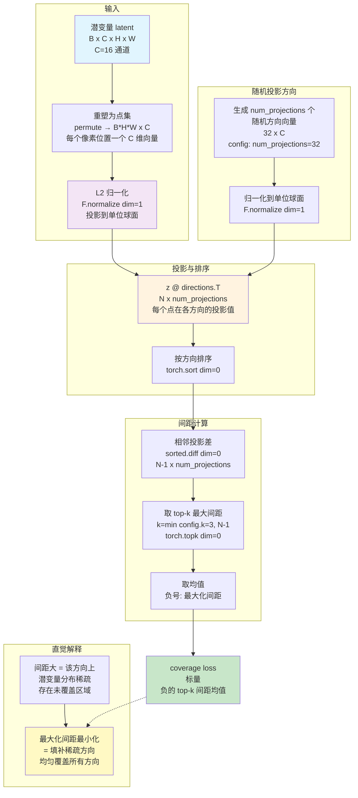
```mermaid
flowchart TD
    subgraph 输入
        LATENT[潜变量 latent<br/>B x C x H x W<br/>C=16 通道]
        RESHAP[重塑为点集<br/>permute → B*H*W x C<br/>每个像素位置一个 C 维向量]
        NORM[L2 归一化<br/>F.normalize dim=1<br/>投影到单位球面]
        LATENT --> RESHAP
        RESHAP --> NORM
    end

    subgraph 随机投影方向
        DIR[生成 num_projections 个<br/>随机方向向量<br/>32 x C<br/>config: num_projections=32]
        NORM_DIR[归一化到单位球面<br/>F.normalize dim=1]
        DIR --> NORM_DIR
    end

    subgraph 投影与排序
        PROJ[z @ directions.T<br/>N x num_projections<br/>每个点在各方向的投影值]
        SORT[按方向排序<br/>torch.sort dim=0]
        PROJ --> SORT
    end

    NORM --> PROJ
    NORM_DIR --> PROJ

    subgraph 间距计算
        DIFF[相邻投影差<br/>sorted.diff dim=0<br/>N-1 x num_projections]
        TOPK[取 top-k 最大间距<br/>k=min config.k=3, N-1<br/>torch.topk dim=0]
        MEAN[取均值<br/>负号: 最大化间距]
        SORT --> DIFF
        DIFF --> TOPK
        TOPK --> MEAN
    end

    MEAN --> OUT[coverage loss<br/>标量<br/>负的 top-k 间距均值]

    subgraph 直觉解释
        INT1[间距大 = 该方向上<br/>潜变量分布稀疏<br/>存在未覆盖区域]
        INT2[最大化间距最小化<br/>= 填补稀疏方向<br/>均匀覆盖所有方向]
        INT1 --> INT2
    end

    OUT -.-> INT2

    style LATENT fill:#e1f5fe
    style NORM fill:#f3e5f5
    style PROJ fill:#fff3e0
    style OUT fill:#c8e6c9
    style INT2 fill:#fff9c4
```

### 1.3 挂谷正则在训练中的集成

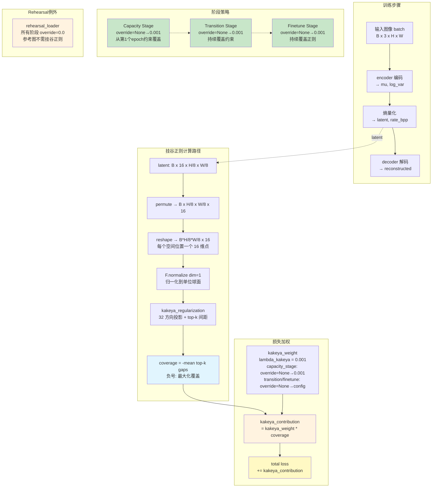
```mermaid
graph TD
    subgraph 训练步骤
        IMG[输入图像 batch<br/>B x 3 x H x W]
        ENC[encoder 编码<br/>→ mu, log_var]
        QUANT[熵量化<br/>→ latent, rate_bpp]
        DEC[decoder 解码<br/>→ reconstructed]

        IMG --> ENC
        ENC --> QUANT
        QUANT --> DEC
    end

    subgraph 挂谷正则计算路径
        L1[latent: B x 16 x H/8 x W/8]
        L2[permute → B x H/8 x W/8 x 16]
        L3[reshape → B*H/8*W/8 x 16<br/>每个空间位置一个 16 维点]
        L4[F.normalize dim=1<br/>归一化到单位球面]
        L5[kakeya_regularization<br/>32 方向投影 + top-k 间距]
        L6[coverage = -mean top-k gaps<br/>负号: 最大化覆盖]

        L1 --> L2
        L2 --> L3
        L3 --> L4
        L4 --> L5
        L5 --> L6
    end

    QUANT -.->|latent| L1

    subgraph 损失加权
        W[kakeya_weight<br/>lambda_kakeya = 0.001<br/>capacity_stage: override=None→0.001<br/>transition/finetune: override=None→config]
        KC[kakeya_contribution<br/>= kakeya_weight * coverage]
        TOTAL[total loss<br/>+= kakeya_contribution]

        L6 --> KC
        W --> KC
        KC --> TOTAL
    end

    subgraph 阶段策略
        S1[Capacity Stage<br/>override=None→0.001<br/>从第1个epoch约束覆盖]
        S2[Transition Stage<br/>override=None→0.001<br/>持续覆盖约束]
        S3[Finetune Stage<br/>override=None→0.001<br/>持续覆盖正则]
        S1 -.-> S2
        S2 -.-> S3
    end

    subgraph Rehearsal例外
        R1[rehearsal_loader<br/>所有阶段 override=0.0<br/>参考图不需挂谷正则]
    end

    style L6 fill:#e1f5fe
    style KC fill:#fff3e0
    style TOTAL fill:#fff9c4
    style S1 fill:#c8e6c9
    style S2 fill:#c8e6c9
    style S3 fill:#c8e6c9
    style R1 fill:#fff3e0
```

### 1.4 挂谷正则对潜空间的影响

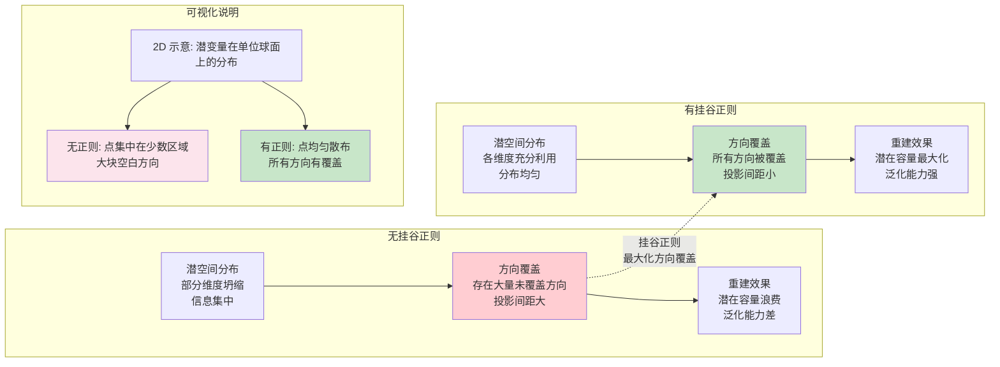
```mermaid
graph LR
    subgraph 无挂谷正则
        BAD1[潜空间分布<br/>部分维度坍缩<br/>信息集中]
        BAD2[方向覆盖<br/>存在大量未覆盖方向<br/>投影间距大]
        BAD3[重建效果<br/>潜在容量浪费<br/>泛化能力差]
        BAD1 --> BAD2
        BAD2 --> BAD3
    end

    subgraph 有挂谷正则
        GOOD1[潜空间分布<br/>各维度充分利用<br/>分布均匀]
        GOOD2[方向覆盖<br/>所有方向被覆盖<br/>投影间距小]
        GOOD3[重建效果<br/>潜在容量最大化<br/>泛化能力强]
        GOOD1 --> GOOD2
        GOOD2 --> GOOD3
    end

    BAD2 -.->|挂谷正则<br/>最大化方向覆盖| GOOD2

    subgraph 可视化说明
        VIZ1[2D 示意: 潜变量在单位球面上的分布]
        VIZ2[无正则: 点集中在少数区域<br/>大块空白方向]
        VIZ3[有正则: 点均匀散布<br/>所有方向有覆盖]
        VIZ1 --> VIZ2
        VIZ1 --> VIZ3
    end

    style BAD2 fill:#ffcdd2
    style GOOD2 fill:#c8e6c9
    style VIZ2 fill:#fce4ec
    style VIZ3 fill:#c8e6c9
```

### 1.5 挂谷猜想 → 图像编解码 完整链路

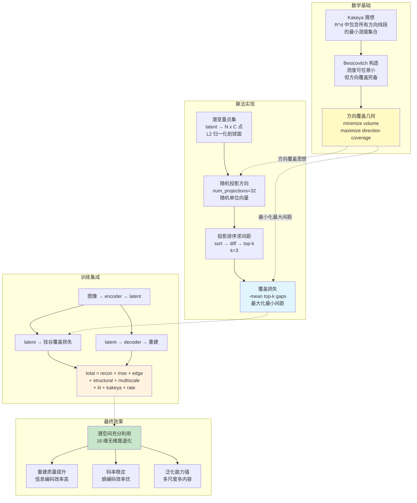
```mermaid
flowchart TD
    subgraph 数学基础
        M1[Kakeya 猜想<br/>R^d 中包含所有方向线段<br/>的最小测度集合]
        M2[Besicovitch 构造<br/>测度可任意小<br/>但方向覆盖完备]
        M3[方向覆盖几何<br/>minimize volume<br/>maximize direction coverage]
        M1 --> M2
        M2 --> M3
    end

    subgraph 算法实现
        A1[潜变量点集<br/>latent → N x C 点<br/>L2 归一化到球面]
        A2[随机投影方向<br/>num_projections=32<br/>随机单位向量]
        A3[投影排序求间距<br/>sort → diff → top-k<br/>k=3]
        A4[覆盖损失<br/>-mean top-k gaps<br/>最大化最小间距]
        A1 --> A2
        A2 --> A3
        A3 --> A4
    end

    M3 -.->|方向覆盖思想| A2
    M3 -.->|最小化最大间距| A4

    subgraph 训练集成
        T1[图像 → encoder → latent]
        T2[latent → 挂谷覆盖损失]
        T3[latent → decoder → 重建]
        T4[total = recon + mse + edge<br/>+ structural + multiscale<br/>+ kl + kakeya + rate]
        T1 --> T2
        T1 --> T3
        T2 --> T4
        T3 --> T4
    end

    A4 -.-> T2

    subgraph 最终效果
        F1[潜空间充分利用<br/>16 维无维度退化]
        F2[重建质量提升<br/>信息编码效率高]
        F3[码率稳定<br/>熵编码效率优]
        F4[泛化能力强<br/>多尺度多内容]
        F1 --> F2
        F1 --> F3
        F1 --> F4
    end

    T4 -.-> F1

    style M3 fill:#fff9c4
    style A4 fill:#e1f5fe
    style T4 fill:#fff3e0
    style F1 fill:#c8e6c9
```

### 1.6 多项式挂谷正则 (polynomial_kakeya_regularization)

项目中还实现了多项式版本的挂谷正则，用于不同 VAE 变体：

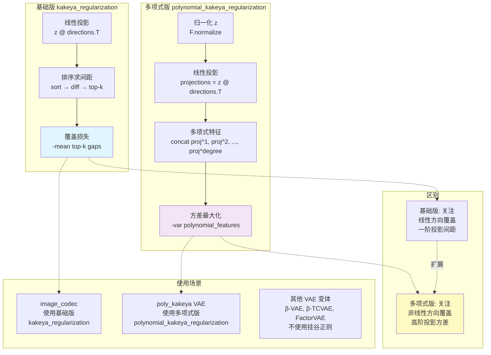
```mermaid
graph TD
    subgraph 基础版 kakeya_regularization
        B1[线性投影<br/>z @ directions.T]
        B2[排序求间距<br/>sort → diff → top-k]
        B3[覆盖损失<br/>-mean top-k gaps]
        B1 --> B2
        B2 --> B3
    end

    subgraph 多项式版 polynomial_kakeya_regularization
        P1[归一化 z<br/>F.normalize]
        P2[线性投影<br/>projections = z @ directions.T]
        P3[多项式特征<br/>concat proj^1, proj^2, ..., proj^degree]
        P4[方差最大化<br/>-var polynomial_features]
        P1 --> P2
        P2 --> P3
        P3 --> P4
    end

    subgraph 区别
        D1[基础版: 关注<br/>线性方向覆盖<br/>一阶投影间距]
        D2[多项式版: 关注<br/>非线性方向覆盖<br/>高阶投影方差]
        D1 -.->|扩展| D2
    end

    B3 -.-> D1
    P4 -.-> D2

    subgraph 使用场景
        U1[image_codec<br/>使用基础版<br/>kakeya_regularization]
        U2[poly_kakeya VAE<br/>使用多项式版<br/>polynomial_kakeya_regularization]
        U3[其他 VAE 变体<br/>β-VAE, β-TCVAE, FactorVAE<br/>不使用挂谷正则]
    end

    B3 -.-> U1
    P4 -.-> U2

    style B3 fill:#e1f5fe
    style P4 fill:#f3e5f5
    style D2 fill:#fff9c4
```

---

## 2. 模型结构 (ImageCodecVAE)

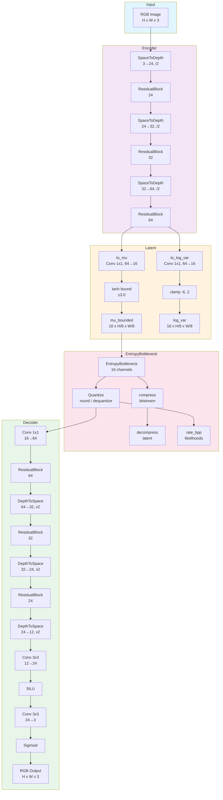
```mermaid
graph TD
    subgraph Input
        IMG[RGB Image<br/>H x W x 3]
    end

    subgraph Encoder
        IMG --> S2D1[SpaceToDepth<br/>3→24, /2]
        S2D1 --> RB1[ResidualBlock<br/>24]
        RB1 --> S2D2[SpaceToDepth<br/>24→32, /2]
        S2D2 --> RB2[ResidualBlock<br/>32]
        RB2 --> S2D3[SpaceToDepth<br/>32→64, /2]
        S2D3 --> RB3[ResidualBlock<br/>64]
    end

    subgraph Latent
        RB3 --> MU[to_mu<br/>Conv 1x1, 64→16]
        RB3 --> LV[to_log_var<br/>Conv 1x1, 64→16]
        MU --> TANH[tanh bound<br/>±3.0]
        TANH --> MU_B[mu_bounded<br/>16 x H/8 x W/8]
        LV --> CLAMP[clamp -6, 2]
        CLAMP --> LV_B[log_var<br/>16 x H/8 x W/8]
    end

    subgraph EntropyBottleneck
        MU_B --> EB[EntropyBottleneck<br/>16 channels]
        EB --> Q[Quantize<br/>round / dequantize]
        EB --> COMP[compress<br/>bitstream]
        COMP --> DECOMP[decompress<br/>latent]
        Q --> RATE[rate_bpp<br/>likelihoods]
    end

    subgraph Decoder
        Q --> D0[Conv 1x1<br/>16→64]
        D0 --> DRB1[ResidualBlock<br/>64]
        DRB1 --> D2S1[DepthToSpace<br/>64→32, x2]
        D2S1 --> DRB2[ResidualBlock<br/>32]
        DRB2 --> D2S2[DepthToSpace<br/>32→24, x2]
        D2S2 --> DRB3[ResidualBlock<br/>24]
        DRB3 --> D2S3[DepthToSpace<br/>24→12, x2]
        D2S3 --> DC1[Conv 3x3<br/>12→24]
        DC1 --> SILU[SiLU]
        SILU --> DC2[Conv 3x3<br/>24→3]
        DC2 --> SIG[Sigmoid]
        SIG --> OUT[RGB Output<br/>H x W x 3]
    end

    style Input fill:#e1f5fe
    style Encoder fill:#f3e5f5
    style Latent fill:#fff3e0
    style EntropyBottleneck fill:#fce4ec
    style Decoder fill:#e8f5e9
```

### 关键组件细节

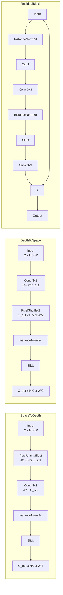
```mermaid
graph LR
    subgraph SpaceToDepth
        A[Input<br/>C x H x W] --> PU[PixelUnshuffle 2<br/>4C x H/2 x W/2]
        PU --> C1[Conv 3x3<br/>4C→C_out]
        C1 --> IN1[InstanceNorm2d]
        IN1 --> AC1[SiLU]
        AC1 --> OUT1[C_out x H/2 x W/2]
    end

    subgraph DepthToSpace
        B[Input<br/>C x H x W] --> C2[Conv 3x3<br/>C→4*C_out]
        C2 --> PS[PixelShuffle 2<br/>C_out x H*2 x W*2]
        PS --> IN2[InstanceNorm2d]
        IN2 --> AC2[SiLU]
        AC2 --> OUT2[C_out x H*2 x W*2]
    end

    subgraph ResidualBlock
        C[Input] --> IN3[InstanceNorm2d]
        IN3 --> AC3[SiLU]
        AC3 --> C3[Conv 3x3]
        C3 --> IN4[InstanceNorm2d]
        IN4 --> AC4[SiLU]
        AC4 --> C4[Conv 3x3]
        C4 --> ADD[+]
        C --> ADD
        ADD --> OUT3[Output]
    end
```

---

## 3. 损失函数组成

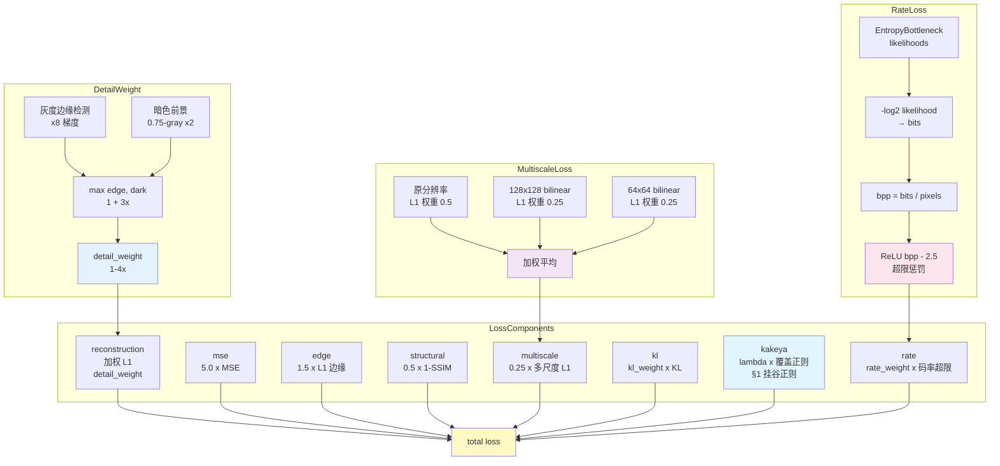
```mermaid
graph TD
    subgraph LossComponents
        L1[reconstruction<br/>加权 L1<br/>detail_weight]
        L2[mse<br/>5.0 x MSE]
        L3[edge<br/>1.5 x L1 边缘]
        L4[structural<br/>0.5 x 1-SSIM]
        L5[multiscale<br/>0.25 x 多尺度 L1]
        L6[kl<br/>kl_weight x KL]
        L7[kakeya<br/>lambda x 覆盖正则<br/>§1 挂谷正则]
        L8[rate<br/>rate_weight x 码率超限]
    end

    L1 --> TOTAL[total loss]
    L2 --> TOTAL
    L3 --> TOTAL
    L4 --> TOTAL
    L5 --> TOTAL
    L6 --> TOTAL
    L7 --> TOTAL
    L8 --> TOTAL

    subgraph DetailWeight
        DW1[灰度边缘检测<br/>x8 梯度]
        DW2[暗色前景<br/>0.75-gray x2]
        DW3[max edge, dark<br/>1 + 3x]
        DW1 --> DW3
        DW2 --> DW3
        DW3 --> DW[detail_weight<br/>1-4x]
        DW --> L1
    end

    subgraph MultiscaleLoss
        MS0[原分辨率<br/>L1 权重 0.5]
        MS1[128x128 bilinear<br/>L1 权重 0.25]
        MS2[64x64 bilinear<br/>L1 权重 0.25]
        MS0 --> MS_AVG[加权平均]
        MS1 --> MS_AVG
        MS2 --> MS_AVG
        MS_AVG --> L5
    end

    subgraph RateLoss
        RL1[EntropyBottleneck<br/>likelihoods]
        RL2[-log2 likelihood<br/>→ bits]
        RL3[bpp = bits / pixels]
        RL4[ReLU bpp - 2.5<br/>超限惩罚]
        RL1 --> RL2
        RL2 --> RL3
        RL3 --> RL4
        RL4 --> L8
    end

    style TOTAL fill:#fff9c4
    style DW fill:#e3f2fd
    style MS_AVG fill:#f3e5f5
    style RL4 fill:#fce4ec
    style L7 fill:#e1f5fe
```

---

## 4. 数据流 (Data Pipeline)

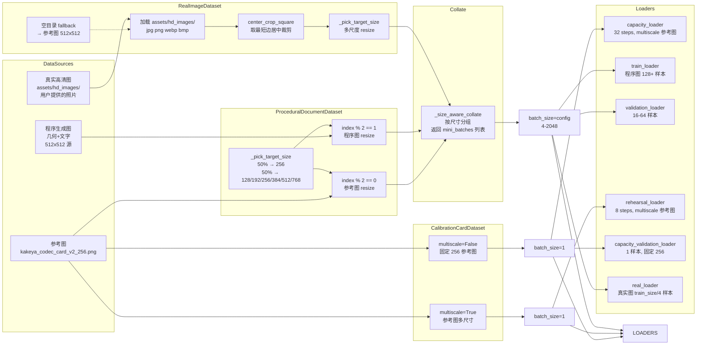
```mermaid
flowchart LR
    subgraph DataSources
        REF_IMG[参考图<br/>kakeya_codec_card_v2_256.png]
        PROC[程序生成图<br/>几何+文字<br/>512x512 源]
        HD_IMG[真实高清图<br/>assets/hd_images/<br/>用户提供的照片]
    end

    subgraph ProceduralDocumentDataset
        PD1[_pick_target_size<br/>50% → 256<br/>50% → 128/192/256/384/512/768]
        PD2[index % 2 == 0<br/>参考图 resize]
        PD3[index % 2 == 1<br/>程序图 resize]
    end

    subgraph RealImageDataset
        RI1[加载 assets/hd_images/<br/>jpg png webp bmp]
        RI2[center_crop_square<br/>取最短边居中裁剪]
        RI3[_pick_target_size<br/>多尺度 resize]
        RI1 --> RI2 --> RI3
        RI4[空目录 fallback<br/>→ 参考图 512x512]
        RI4 -.-> RI1
    end

    subgraph CalibrationCardDataset
        CC1[multiscale=False<br/>固定 256 参考图]
        CC2[multiscale=True<br/>参考图多尺寸]
    end

    REF_IMG --> PD2
    REF_IMG --> CC1
    REF_IMG --> CC2
    PROC --> PD3
    HD_IMG --> RI1
    PD1 --> PD2
    PD1 --> PD3

    PD2 --> COLLATE
    PD3 --> COLLATE
    RI3 --> COLLATE

    subgraph Collate
        COLLATE[_size_aware_collate<br/>按尺寸分组<br/>返回 mini_batches 列表]
    end

    CC1 --> BATCH1[batch_size=1]
    CC2 --> BATCH2[batch_size=1]
    COLLATE --> BATCH3[batch_size=config<br/>4-2048]

    BATCH1 --> LOADERS
    BATCH2 --> LOADERS
    BATCH3 --> LOADERS

    subgraph Loaders
        L1[capacity_loader<br/>32 steps, multiscale 参考图]
        L2[train_loader<br/>程序图 128+ 样本]
        L3[validation_loader<br/>16-64 样本]
        L4[rehearsal_loader<br/>8 steps, multiscale 参考图]
        L5[capacity_validation_loader<br/>1 样本, 固定 256]
        L6[real_loader<br/>真实图 train_size/4 样本]
    end

    BATCH1 --> L1
    BATCH2 --> L4
    BATCH3 --> L2
    BATCH3 --> L3
    BATCH3 --> L6
    BATCH1 --> L5
```

---

## 5. 训练流程 (train_image_codec)

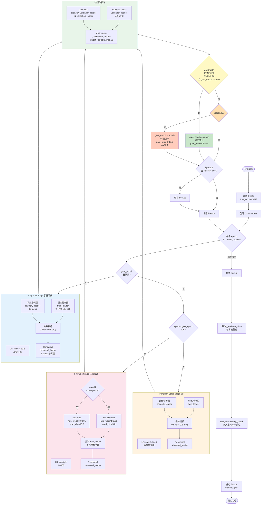
```mermaid
flowchart TD
    START([开始训练]) --> INIT[初始化模型<br/>ImageCodecVAE]
    INIT --> LOADERS[创建 DataLoaders]
    LOADERS --> LOOP{每个 epoch<br/>1 → config.epochs}

    LOOP --> CHECK{gate_epoch<br/>已设置?}
    CHECK -->|否| CAP[Capacity Stage<br/>gate_epoch = None]
    CHECK -->|是| CHECK2{epoch - gate_epoch<br/>≤ 5?}
    CHECK2 -->|是| TRANS[Transition Stage<br/>过渡阶段]
    CHECK2 -->|否| FINETUNE[Finetune Stage<br/>压缩微调]

    subgraph CAP [Capacity Stage 容量阶段]
        direction TB
        CAP_LR[LR: max lr, 1e-3<br/>高学习率]
        CAP_REF[训练参考图<br/>capacity_loader<br/>32 steps]
        CAP_PROG[训练程序图<br/>train_loader<br/>多尺度 128-768]
        CAP_REH[Rehearsal<br/>rehearsal_loader<br/>8 steps 参考图]
        CAP_REF --> CAP_MERGE[合并指标<br/>0.5 ref + 0.5 prog]
        CAP_PROG --> CAP_MERGE
        CAP_MERGE --> CAP_REH
    end

    subgraph TRANS [Transition Stage 过渡阶段]
        direction TB
        TRANS_LR[LR: max lr, 5e-4<br/>中等学习率]
        TRANS_REF[训练参考图<br/>capacity_loader]
        TRANS_PROG[训练程序图<br/>train_loader]
        TRANS_REH[Rehearsal<br/>rehearsal_loader]
        TRANS_REF --> TRANS_MERGE[合并指标<br/>0.5 ref + 0.5 prog]
        TRANS_PROG --> TRANS_MERGE
        TRANS_MERGE --> TRANS_REH
    end

    subgraph FINETUNE [Finetune Stage 压缩微调]
        direction TB
        FT_LR[LR: config.lr<br/>0.0005]
        FT_WARMUP{gate 后<br/>≤ 10 epochs?}
        FT_WARMUP -->|是| FT_W[Warmup<br/>rate_weight=0.001<br/>grad_clip=10.0]
        FT_WARMUP -->|否| FT_FULL[Full finetune<br/>rate_weight=0.01<br/>grad_clip=5.0]
        FT_W --> FT_TRAIN[训练 train_loader<br/>多尺度程序图]
        FT_FULL --> FT_TRAIN
        FT_TRAIN --> FT_REH[Rehearsal<br/>rehearsal_loader]
    end

    CAP --> VALID
    TRANS --> VALID
    FINETUNE --> VALID

    subgraph VALID [验证与校准]
        direction TB
        V1[Validation<br/>capacity_validation_loader<br/>或 validation_loader]
        V2[Generalization<br/>validation_loader<br/>泛化测试]
        V3[Calibration<br/>_calibration_metrics<br/>参考图 PSNR/SSIM/bpp]
        V1 --> V3
        V2 --> V3
    end

    VALID --> GATE_CHK{Calibration<br/>PSNR≥26<br/>SSIM≥0.96<br/>且 gate_epoch=None?}
    GATE_CHK -->|是| SET_GATE[gate_epoch = epoch<br/>闸门通过<br/>gate_forced=False]
    GATE_CHK -->|否| FORCE_CHK{epoch≥40?}
    FORCE_CHK -->|是| FORCE_GATE[gate_epoch = epoch<br/>强制过闸<br/>gate_forced=True<br/>log 警告]
    FORCE_CHK -->|否| CKPT_CHK
    SET_GATE --> CKPT_CHK
    FORCE_GATE --> CKPT_CHK

    CKPT_CHK{bpp≤2.5<br/>且 PSNR > best?}
    CKPT_CHK -->|是| SAVE_BEST[保存 best.pt]
    CKPT_CHK -->|否| NEXT

    SAVE_BEST --> NEXT[记录 history]
    NEXT --> LOOP

    LOOP -->|训练结束| LOAD_BEST[加载 best.pt]
    LOAD_BEST --> EVAL[评估 _evaluate_chart<br/>参考图重建]
    EVAL --> RATE_CHK[rate_consistency_check<br/>多尺度码率一致性]
    RATE_CHK --> SAVE_FINAL[保存 final.pt<br/>manifest.json]
    SAVE_FINAL --> DONE([训练完成])

    style CAP fill:#e3f2fd
    style TRANS fill:#fff3e0
    style FINETUNE fill:#fce4ec
    style VALID fill:#e8f5e9
    style GATE_CHK fill:#fff9c4
    style SET_GATE fill:#c8e6c9
    style FORCE_CHK fill:#ffe0b2
    style FORCE_GATE fill:#ffccbc
```

---

## 6. 训练阶段时序图

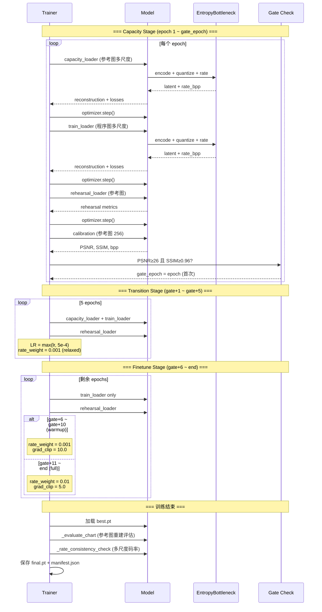
```mermaid
sequenceDiagram
    participant T as Trainer
    participant M as Model
    participant EB as EntropyBottleneck
    participant G as Gate Check

    Note over T,G: === Capacity Stage (epoch 1 ~ gate_epoch) ===

    loop 每个 epoch
        T->>M: capacity_loader (参考图多尺度)
        M->>EB: encode + quantize + rate
        EB-->>M: latent + rate_bpp
        M-->>T: reconstruction + losses
        T->>M: optimizer.step()

        T->>M: train_loader (程序图多尺度)
        M->>EB: encode + quantize + rate
        EB-->>M: latent + rate_bpp
        M-->>T: reconstruction + losses
        T->>M: optimizer.step()

        T->>M: rehearsal_loader (参考图)
        M-->>T: rehearsal metrics
        T->>M: optimizer.step()

        T->>M: calibration (参考图 256)
        M-->>T: PSNR, SSIM, bpp

        T->>G: PSNR≥26 且 SSIM≥0.96?
        G-->>T: gate_epoch = epoch (首次)
    end

    Note over T,G: === Transition Stage (gate+1 ~ gate+5) ===

    loop 5 epochs
        T->>M: capacity_loader + train_loader
        T->>M: rehearsal_loader
        Note over T: LR = max(lr, 5e-4)<br/>rate_weight = 0.001 (relaxed)
    end

    Note over T,G: === Finetune Stage (gate+6 ~ end) ===

    loop 剩余 epochs
        T->>M: train_loader only
        T->>M: rehearsal_loader

        alt gate+6 ~ gate+10 (warmup)
            Note over T: rate_weight = 0.001<br/>grad_clip = 10.0
        else gate+11 ~ end (full)
            Note over T: rate_weight = 0.01<br/>grad_clip = 5.0
        end
    end

    Note over T,G: === 训练结束 ===
    T->>M: 加载 best.pt
    T->>M: _evaluate_chart (参考图重建评估)
    T->>M: _rate_consistency_check (多尺度码率)
    T->>T: 保存 final.pt + manifest.json
```

---

## 7. 推理流程 (Web API / CLI)

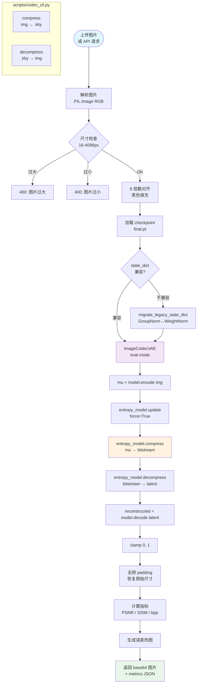
```mermaid
flowchart TD
    UPLOAD([上传图片<br/>或 API 请求]) --> PARSE[解析图片<br/>PIL.Image RGB]

    PARSE --> SIZE_CHK{尺寸检查<br/>16-4096px}
    SIZE_CHK -->|过大| ERR1[400: 图片过大]
    SIZE_CHK -->|过小| ERR2[400: 图片过小]
    SIZE_CHK -->|OK| PAD[8 倍数对齐<br/>黑色填充]

    PAD --> LOAD_CKPT[加载 checkpoint<br/>final.pt]
    LOAD_CKPT --> MIGRATE{state_dict<br/>兼容?}
    MIGRATE -->|不兼容| MIG[migrate_legacy_state_dict<br/>GroupNorm→WeightNorm]
    MIGRATE -->|兼容| MODEL
    MIG --> MODEL[ImageCodecVAE<br/>eval mode]

    MODEL --> ENCODE[mu = model.encode img]
    ENCODE --> EB_UPDATE[entropy_model.update<br/>force=True]
    EB_UPDATE --> COMPRESS[entropy_model.compress<br/>mu → bitstream]
    COMPRESS --> DECOMPRESS[entropy_model.decompress<br/>bitstream → latent]
    DECOMPRESS --> DECODE[reconstructed = model.decode latent]
    DECODE --> CLAMP[clamp 0, 1]

    CLAMP --> CROP[去除 padding<br/>恢复原始尺寸]
    CROP --> METRICS[计算指标<br/>PSNR / SSIM / bpp]
    METRICS --> HEATMAP[生成误差热图]
    HEATMAP --> RESP[返回 base64 图片<br/>+ metrics JSON]

    subgraph CLI [scripts/codec_cli.py]
        CLI_COMP[compress<br/>img → .kky]
        CLI_DECOMP[decompress<br/>.kky → img]
    end

    style UPLOAD fill:#e1f5fe
    style MODEL fill:#f3e5f5
    style COMPRESS fill:#fff3e0
    style RESP fill:#e8f5e9
```

---

## 8. Web API 端点结构

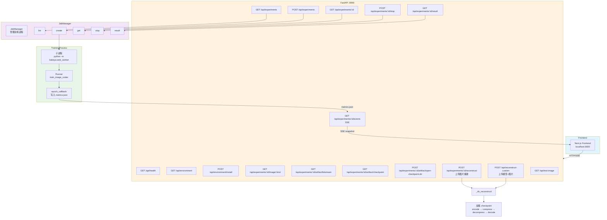
```mermaid
graph TD
    subgraph Frontend
        UI[Next.js Frontend<br/>localhost:3000]
    end

    subgraph WebAPI [FastAPI :8000]
        HEALTH[GET /api/health]
        ENV[GET /api/environment]
        ENV_INST[POST /api/environment/install]

        EXP_LIST[GET /api/experiments]
        EXP_CREATE[POST /api/experiments]
        EXP_GET[GET /api/experiments/:id]
        EXP_STOP[POST /api/experiments/:id/stop]
        EXP_RESULT[GET /api/experiments/:id/result]
        EXP_IMG[GET /api/experiments/:id/image/:kind]
        EXP_EVENTS[GET /api/experiments/:id/events<br/>SSE]

        BITSTREAM[GET /api/experiments/:id/artifact/bitstream]
        CHECKPOINT[GET /api/experiments/:id/artifact/checkpoint]
        OPEN_DIR[POST /api/experiments/:id/artifact/open-checkpoint-dir]

        RECON_UP[POST /api/experiments/:id/reconstruct<br/>上传图片重建]
        RECON_CUSTOM[POST /api/reconstruct-custom<br/>上传模型+图片]

        TEST_IMG[GET /api/test-image]
    end

    subgraph JobManager
        JM[JobManager<br/>管理训练进程]
        JM_LIST[list]
        JM_CREATE[create]
        JM_GET[get]
        JM_STOP[stop]
        JM_RESULT[result]
    end

    subgraph TrainingProcess
        WORKER[子进程<br/>python -m kakeya.web_worker]
        RUNNER[Runner<br/>train_image_codec]
        EPOCH_CB[epoch_callback<br/>写入 metrics.json]
    end

    UI -->|HTTP/SSE| WebAPI
    EXP_CREATE --> JM_CREATE
    JM_CREATE --> WORKER
    WORKER --> RUNNER
    RUNNER --> EPOCH_CB
    EPOCH_CB -->|metrics.json| EXP_EVENTS
    EXP_EVENTS -->|SSE snapshot| UI

    EXP_LIST --> JM_LIST
    EXP_GET --> JM_GET
    EXP_STOP --> JM_STOP
    EXP_RESULT --> JM_RESULT

    RECON_UP --> DO_RECON[_do_reconstruct]
    RECON_CUSTOM --> DO_RECON
    DO_RECON --> ENCODE_DECODE[加载 checkpoint<br/>encode → compress → decompress → decode]

    style Frontend fill:#e1f5fe
    style WebAPI fill:#fff3e0
    style JobManager fill:#f3e5f5
    style TrainingProcess fill:#e8f5e9
```

---

## 9. 泛化能力与高清大图处理

> 本节记录项目实际遇到的问题、诊断过程与优化方案。

### 9.1 泛化问题诊断

模型曾出现严重的过拟合——只学会重建 256² 参考图，对其他内容失效：

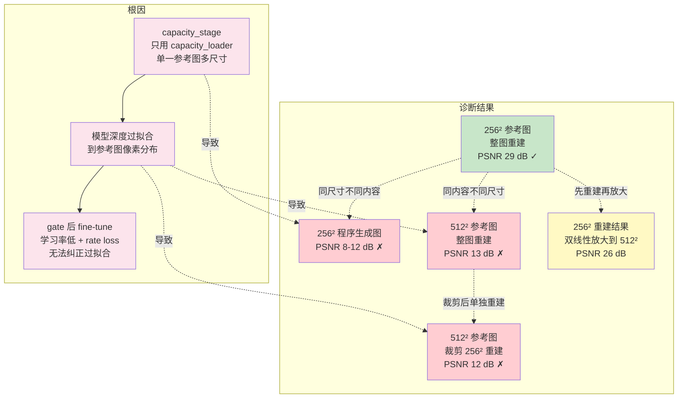
```mermaid
graph TD
    subgraph 诊断结果
        T1[256² 参考图<br/>整图重建<br/>PSNR 29 dB ✓]
        T2[256² 程序生成图<br/>PSNR 8-12 dB ✗]
        T3[512² 参考图<br/>整图重建<br/>PSNR 13 dB ✗]
        T4[512² 参考图<br/>裁剪 256² 重建<br/>PSNR 12 dB ✗]
        T5[256² 重建结果<br/>双线性放大到 512²<br/>PSNR 26 dB]
    end

    T1 -.->|同尺寸不同内容| T2
    T1 -.->|同内容不同尺寸| T3
    T3 -.->|裁剪后单独重建| T4
    T1 -.->|先重建再放大| T5

    subgraph 根因
        R1[capacity_stage<br/>只用 capacity_loader<br/>单一参考图多尺寸]
        R2[模型深度过拟合<br/>到参考图像素分布]
        R3[gate 后 fine-tune<br/>学习率低 + rate loss<br/>无法纠正过拟合]
        R1 --> R2
        R2 --> R3
    end

    R1 -.->|导致| T2
    R2 -.->|导致| T3
    R2 -.->|导致| T4

    style T1 fill:#c8e6c9
    style T2 fill:#ffcdd2
    style T3 fill:#ffcdd2
    style T4 fill:#ffcdd2
    style T5 fill:#fff9c4
    style R1 fill:#fce4ec
    style R2 fill:#fce4ec
    style R3 fill:#fce4ec
```

### 9.2 修复后的训练数据策略

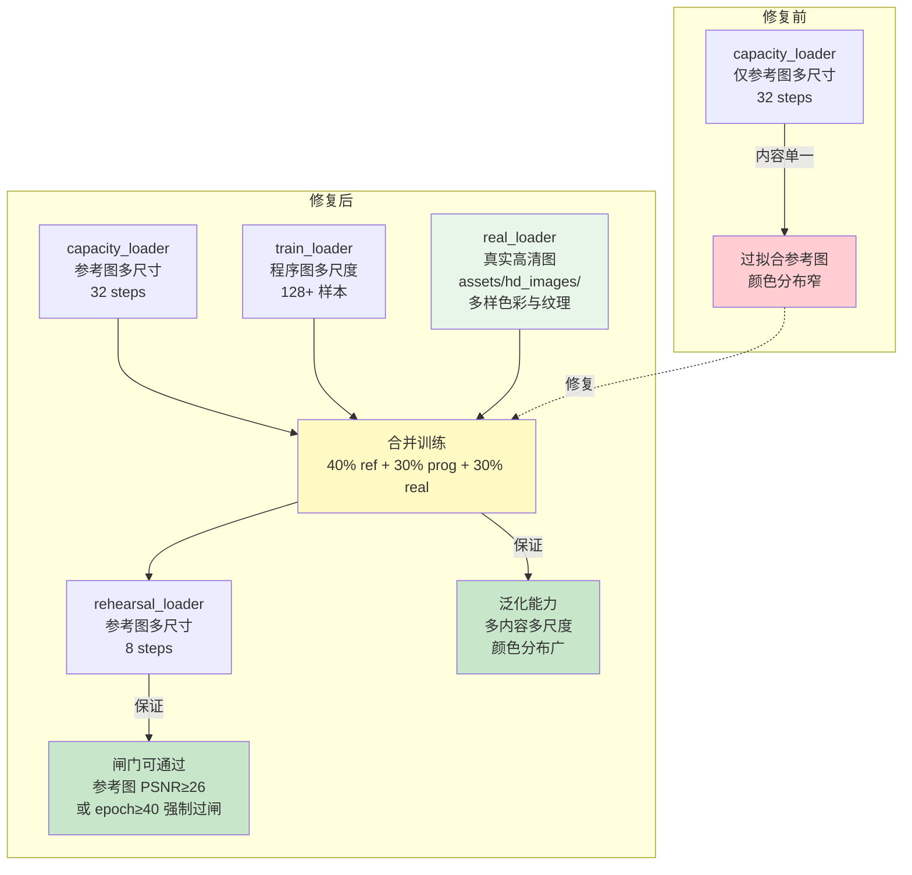
```mermaid
graph TD
    subgraph 修复前
        OLD_CAP[capacity_loader<br/>仅参考图多尺寸<br/>32 steps]
        OLD_CAP -->|内容单一| OVERFIT[过拟合参考图<br/>颜色分布窄]
    end

    subgraph 修复后
        NEW_CAP_REF[capacity_loader<br/>参考图多尺寸<br/>32 steps]
        NEW_CAP_PROG[train_loader<br/>程序图多尺度<br/>128+ 样本]
        NEW_CAP_REAL[real_loader<br/>真实高清图<br/>assets/hd_images/<br/>多样色彩与纹理]
        NEW_REH[rehearsal_loader<br/>参考图多尺寸<br/>8 steps]

        NEW_CAP_REF --> MERGE[合并训练<br/>40% ref + 30% prog + 30% real]
        NEW_CAP_PROG --> MERGE
        NEW_CAP_REAL --> MERGE
        MERGE --> NEW_REH
        NEW_REH -->|保证| GATE[闸门可通过<br/>参考图 PSNR≥26<br/>或 epoch≥40 强制过闸]
        MERGE -->|保证| GEN[泛化能力<br/>多内容多尺度<br/>颜色分布广]
    end

    OVERFIT -.->|修复| MERGE

    style OVERFIT fill:#ffcdd2
    style GATE fill:#c8e6c9
    style GEN fill:#c8e6c9
    style MERGE fill:#fff9c4
    style NEW_CAP_REAL fill:#e8f5e9
```

### 9.3 高清大图推理流程

推理时不分块、不缩放，整图通过模型（padding 到 8 的倍数）：

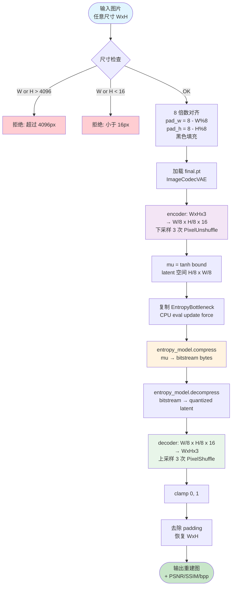
```mermaid
flowchart TD
    INPUT([输入图片<br/>任意尺寸 WxH]) --> CHK{尺寸检查}
    CHK -->|W or H > 4096| REJECT[拒绝: 超过 4096px]
    CHK -->|W or H < 16| REJECT2[拒绝: 小于 16px]
    CHK -->|OK| PAD[8 倍数对齐<br/>pad_w = 8 - W%8<br/>pad_h = 8 - H%8<br/>黑色填充]

    PAD --> LOAD[加载 final.pt<br/>ImageCodecVAE]
    LOAD --> ENCODE[encoder: WxHx3<br/>→ W/8 x H/8 x 16<br/>下采样 3 次 PixelUnshuffle]

    ENCODE --> MU[mu = tanh bound<br/>latent 空间 H/8 x W/8]
    MU --> EB_COPY[复制 EntropyBottleneck<br/>CPU eval update force]

    EB_COPY --> COMPRESS[entropy_model.compress<br/>mu → bitstream bytes]
    COMPRESS --> DECOMPRESS[entropy_model.decompress<br/>bitstream → quantized latent]
    DECOMPRESS --> DECODE[decoder: W/8 x H/8 x 16<br/>→ WxHx3<br/>上采样 3 次 PixelShuffle]

    DECODE --> CLAMP[clamp 0, 1]
    CLAMP --> CROP[去除 padding<br/>恢复 WxH]
    CROP --> OUT([输出重建图<br/>+ PSNR/SSIM/bpp])

    style INPUT fill:#e1f5fe
    style ENCODE fill:#f3e5f5
    style COMPRESS fill:#fff3e0
    style DECODE fill:#e8f5e9
    style OUT fill:#c8e6c9
    style REJECT fill:#ffcdd2
    style REJECT2 fill:#ffcdd2
```

### 9.4 多尺度训练覆盖范围

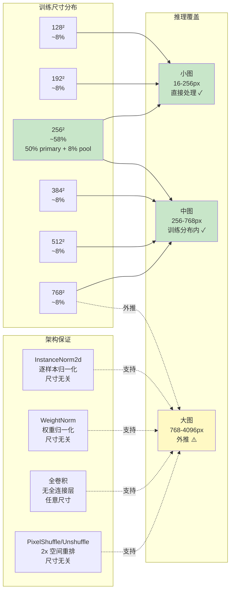
```mermaid
graph LR
    subgraph 训练尺寸分布
        S128[128²<br/>~8%]
        S192[192²<br/>~8%]
        S256[256²<br/>~58%<br/>50% primary + 8% pool]
        S384[384²<br/>~8%]
        S512[512²<br/>~8%]
        S768[768²<br/>~8%]
    end

    subgraph 推理覆盖
        I_SMALL[小图<br/>16-256px<br/>直接处理 ✓]
        I_MED[中图<br/>256-768px<br/>训练分布内 ✓]
        I_LARGE[大图<br/>768-4096px<br/>外推 ⚠️]
    end

    S128 --> I_SMALL
    S192 --> I_SMALL
    S256 --> I_SMALL
    S256 --> I_MED
    S384 --> I_MED
    S512 --> I_MED
    S768 --> I_MED
    S768 -.->|外推| I_LARGE

    subgraph 架构保证
        ARCH1[InstanceNorm2d<br/>逐样本归一化<br/>尺寸无关]
        ARCH2[WeightNorm<br/>权重归一化<br/>尺寸无关]
        ARCH3[全卷积<br/>无全连接层<br/>任意尺寸]
        ARCH4[PixelShuffle/Unshuffle<br/>2x 空间重排<br/>尺寸无关]
    end

    ARCH1 -.->|支持| I_LARGE
    ARCH2 -.->|支持| I_LARGE
    ARCH3 -.->|支持| I_LARGE
    ARCH4 -.->|支持| I_LARGE

    style S256 fill:#c8e6c9
    style I_SMALL fill:#c8e6c9
    style I_MED fill:#c8e6c9
    style I_LARGE fill:#fff9c4
```

### 9.5 高清大图颜色与亮度问题

#### 9.5.1 历史诊断：过拟合导致颜色丢失

模型早期出现严重的过拟合问题——只学会重建 256² 参考图，对其他内容完全失效：

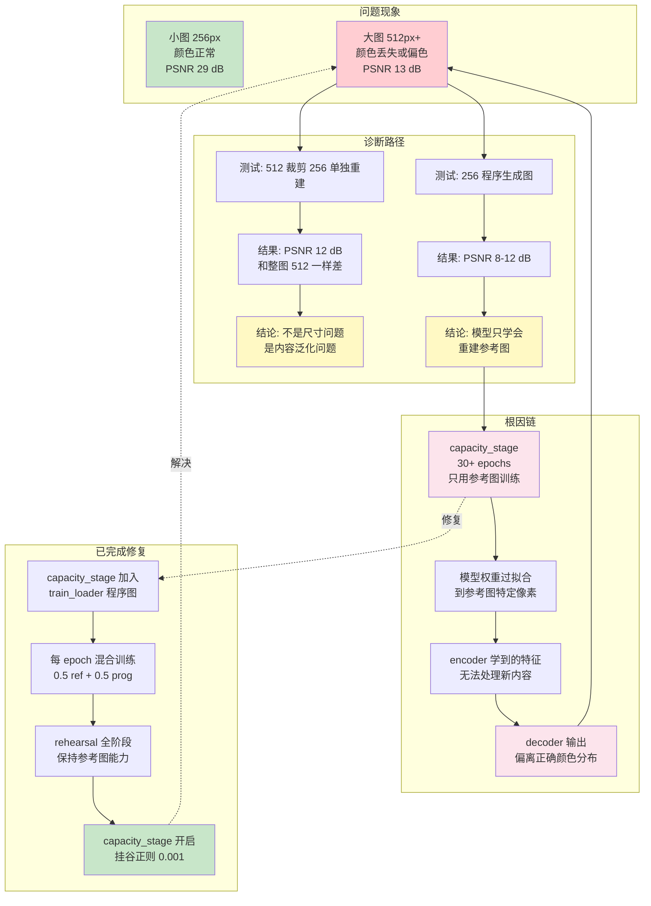
```mermaid
flowchart TD
    subgraph 问题现象
        PHEN1[小图 256px<br/>颜色正常<br/>PSNR 29 dB]
        PHEN2[大图 512px+<br/>颜色丢失或偏色<br/>PSNR 13 dB]
    end

    subgraph 诊断路径
        D1[测试: 512 裁剪 256 单独重建]
        D2[结果: PSNR 12 dB<br/>和整图 512 一样差]
        D3[结论: 不是尺寸问题<br/>是内容泛化问题]
        D4[测试: 256 程序生成图]
        D5[结果: PSNR 8-12 dB]
        D6[结论: 模型只学会<br/>重建参考图]
        D1 --> D2 --> D3
        D4 --> D5 --> D6
    end

    PHEN2 --> D1
    PHEN2 --> D4

    subgraph 根因链
        ROOT1[capacity_stage<br/>30+ epochs<br/>只用参考图训练]
        ROOT2[模型权重过拟合<br/>到参考图特定像素]
        ROOT3[encoder 学到的特征<br/>无法处理新内容]
        ROOT4[decoder 输出<br/>偏离正确颜色分布]
        ROOT1 --> ROOT2
        ROOT2 --> ROOT3
        ROOT3 --> ROOT4
    end

    D6 --> ROOT1
    ROOT4 --> PHEN2

    subgraph 已完成修复
        FIX1[capacity_stage 加入<br/>train_loader 程序图]
        FIX2[每 epoch 混合训练<br/>0.5 ref + 0.5 prog]
        FIX3[rehearsal 全阶段<br/>保持参考图能力]
        FIX4[capacity_stage 开启<br/>挂谷正则 0.001]
        FIX1 --> FIX2
        FIX2 --> FIX3
        FIX3 --> FIX4
    end

    ROOT1 -.->|修复| FIX1
    FIX4 -.->|解决| PHEN2

    style PHEN1 fill:#c8e6c9
    style PHEN2 fill:#ffcdd2
    style D3 fill:#fff9c4
    style D6 fill:#fff9c4
    style ROOT1 fill:#fce4ec
    style ROOT4 fill:#fce4ec
    style FIX4 fill:#c8e6c9
```

#### 9.5.2 真实颜色问题的根因：训练集多样性不足

泛化问题修复后，大图仍存在颜色偏移（如整体泛蓝、暗红色偏色）。**最初以为是损失函数的颜色约束不够强，尝试了多种损失函数优化（LAB ΔE 色差、RGB 通道 detail_weight、亮度自适应权重等），但实测效果有限甚至拖累训练速度，最终已从代码中移除。** 真正的根因是训练数据的颜色分布过于单一——增加真实高清多彩图片到训练集后，问题立竿见影地解决。

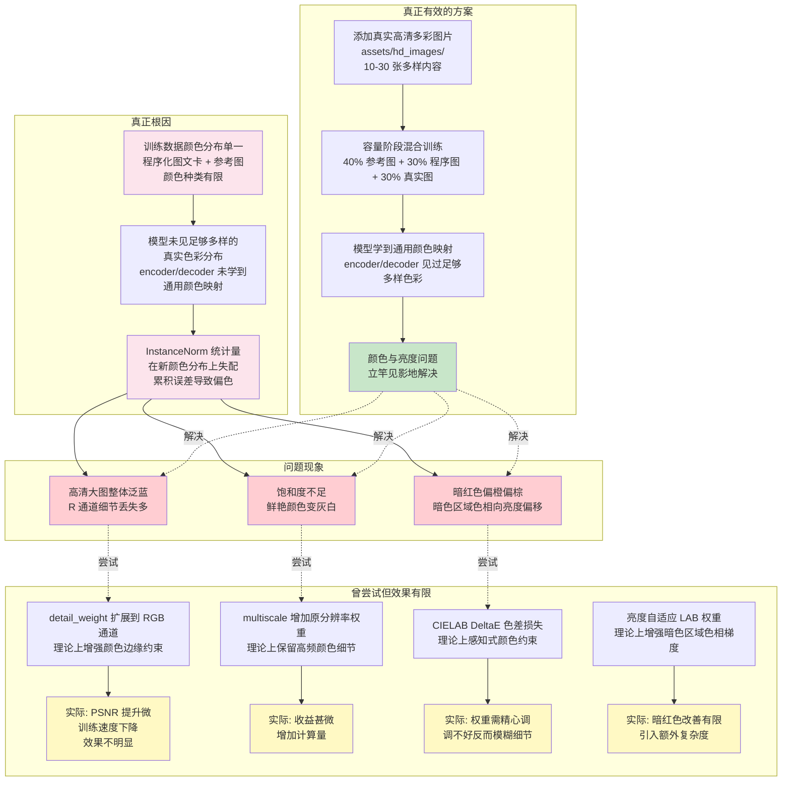
```mermaid
flowchart TD
    subgraph 问题现象
        P1[高清大图整体泛蓝<br/>R 通道细节丢失多]
        P2[暗红色偏橙偏棕<br/>暗色区域色相向亮度偏移]
        P3[饱和度不足<br/>鲜艳颜色变灰白]
    end

    subgraph 曾尝试但效果有限
        ATT1[detail_weight 扩展到 RGB 通道<br/>理论上增强颜色边缘约束]
        ATT2[multiscale 增加原分辨率权重<br/>理论上保留高频颜色细节]
        ATT3[CIELAB DeltaE 色差损失<br/>理论上感知式颜色约束]
        ATT4[亮度自适应 LAB 权重<br/>理论上增强暗色区域色相梯度]

        ATT1 --> RESULT1[实际: PSNR 提升微<br/>训练速度下降<br/>效果不明显]
        ATT2 --> RESULT2[实际: 收益甚微<br/>增加计算量]
        ATT3 --> RESULT3[实际: 权重需精心调<br/>调不好反而模糊细节]
        ATT4 --> RESULT4[实际: 暗红色改善有限<br/>引入额外复杂度]
    end

    subgraph 真正根因
        R1[训练数据颜色分布单一<br/>程序化图文卡 + 参考图<br/>颜色种类有限]
        R2[模型未见足够多样的<br/>真实色彩分布<br/>encoder/decoder 未学到<br/>通用颜色映射]
        R3[InstanceNorm 统计量<br/>在新颜色分布上失配<br/>累积误差导致偏色]
        R1 --> R2 --> R3
    end

    subgraph 真正有效的方案
        S1[添加真实高清多彩图片<br/>assets/hd_images/<br/>10-30 张多样内容]
        S2[容量阶段混合训练<br/>40% 参考图 + 30% 程序图 + 30% 真实图]
        S3[模型学到通用颜色映射<br/>encoder/decoder 见过足够多样色彩]
        S4[颜色与亮度问题<br/>立竿见影地解决]
        S1 --> S2 --> S3 --> S4
    end

    P1 -.->|尝试| ATT1
    P2 -.->|尝试| ATT3
    P3 -.->|尝试| ATT2
    R3 --> P1
    R3 --> P2
    R3 --> P3
    S4 -.->|解决| P1
    S4 -.->|解决| P2
    S4 -.->|解决| P3

    style P1 fill:#ffcdd2
    style P2 fill:#ffcdd2
    style P3 fill:#ffcdd2
    style RESULT1 fill:#fff9c4
    style RESULT2 fill:#fff9c4
    style RESULT3 fill:#fff9c4
    style RESULT4 fill:#fff9c4
    style R1 fill:#fce4ec
    style R3 fill:#fce4ec
    style S4 fill:#c8e6c9
```

#### 9.5.3 经验教训：损失函数 vs 数据质量

**核心结论：对于颜色还原问题，训练数据的多样性和覆盖面远比损失函数的精细调整重要。**

```mermaid
graph LR
    subgraph 损失函数优化路线
        L1[增加更多损失项<br/>LAB / perceptual / detail]
        L2[调权重 / 加自适应机制]
        L3[训练速度下降<br/>调参成本高<br/>边际收益低]
        L1 --> L2 --> L3
    end

    subgraph 数据质量路线
        D1[增加真实多样的训练图片]
        D2[扩展颜色与纹理分布]
        D3[模型自然学到通用映射<br/>效果立竿见影<br/>训练速度不受影响]
        D1 --> D2 --> D3
    end

    subgraph 对比结论
        C1[数据 > 损失函数<br/>好数据胜过精巧的损失设计]
        C2[损失函数是放大器<br/>数据分布决定上限]
    end

    L3 -.->|对比| C1
    D3 -.->|对比| C1
    C1 --> C2

    style L3 fill:#fff9c4
    style D3 fill:#c8e6c9
    style C1 fill:#e1f5fe
    style C2 fill:#e1f5fe
```

### 9.6 码率一致性检查 (rate consistency)

训练结束后验证多尺度码率稳定性：

```mermaid
flowchart LR
    subgraph 测试流程
        SRC[参考图 256²] --> SCALE1[0.5x → 128²]
        SRC --> SCALE2[1.0x → 256²]
        SRC --> SCALE3[1.5x → 384²]
        SRC --> SCALE4[2.0x → 512²]

        SCALE1 --> ENC1[encode + rate_bpp]
        SCALE2 --> ENC2[encode + rate_bpp]
        SCALE3 --> ENC3[encode + rate_bpp]
        SCALE4 --> ENC4[encode + rate_bpp]

        ENC2 --> REF_BPP[reference_bpp]
        ENC1 --> DEV1[bpp_deviation]
        ENC3 --> DEV3[bpp_deviation]
        ENC4 --> DEV4[bpp_deviation]

        REF_BPP --> MAX_DEV[max_deviation]
        DEV1 --> MAX_DEV
        DEV3 --> MAX_DEV
        DEV4 --> MAX_DEV
    end

    subgraph 期望结果
        GOOD[一致性良好<br/>max_deviation < 5%<br/>大图 bpp 稳定]
        BAD[一致性差<br/>max_deviation > 20%<br/>大图码率漂移]
    end

    MAX_DEV --> GOOD
    MAX_DEV -.->|过拟合时| BAD

    style GOOD fill:#c8e6c9
    style BAD fill:#ffcdd2
    style MAX_DEV fill:#fff9c4
```
