# Kakeya Image Codec 架构图

> 文档顺序遵循项目逻辑故事线：**为什么做（挂谷猜想）→ 怎么做（模型/损失/数据/训练）→ 怎么用（推理/API）→ 遇到什么问题（泛化/大图）**

---

## 1. 挂谷猜想 (Kakeya Conjecture) 与潜空间正则化

> 本项目的核心创新。受挂谷猜想启发，通过随机投影方向上的最大间距最大化潜变量的方向覆盖，避免 VAE 后验坍缩。

### 1.1 挂谷猜想的几何直觉

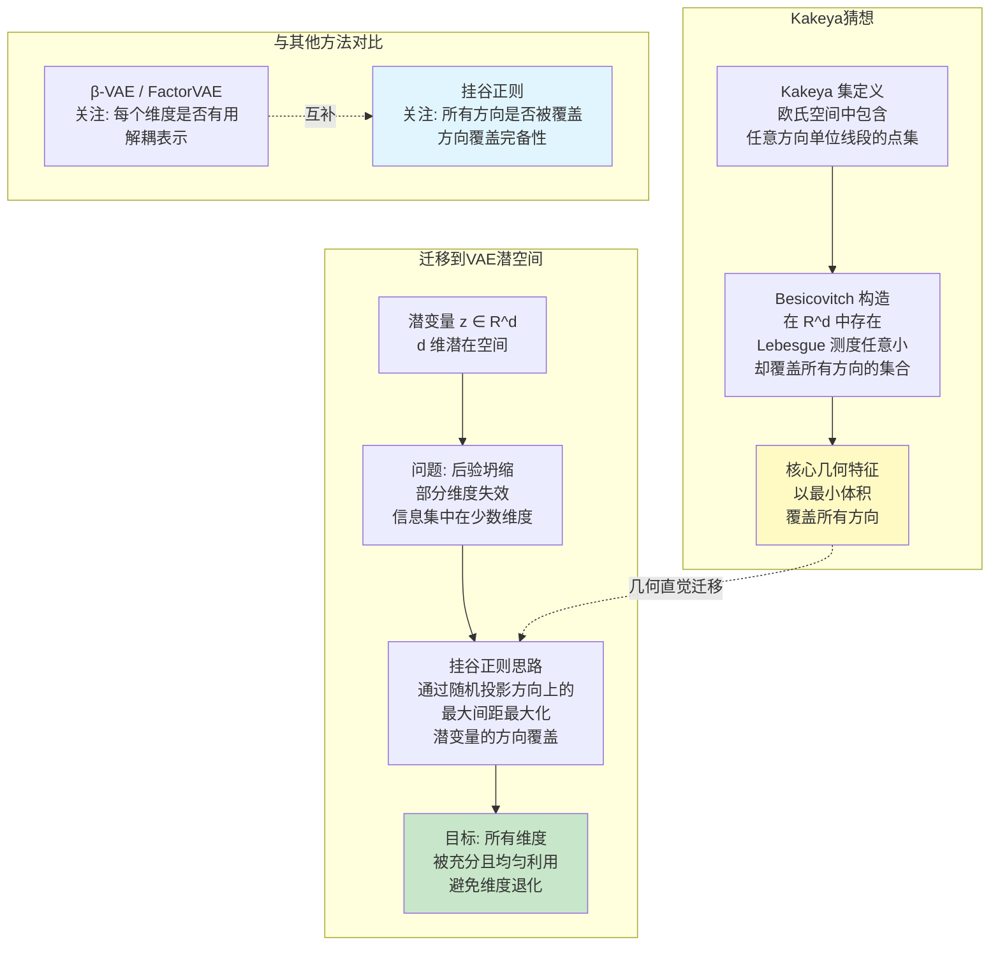

### 1.2 挂谷正则化算法 (kakeya_regularization)

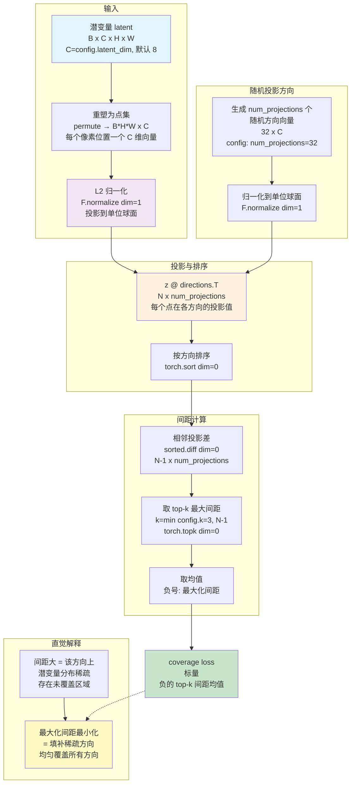

### 1.3 挂谷正则在训练中的集成

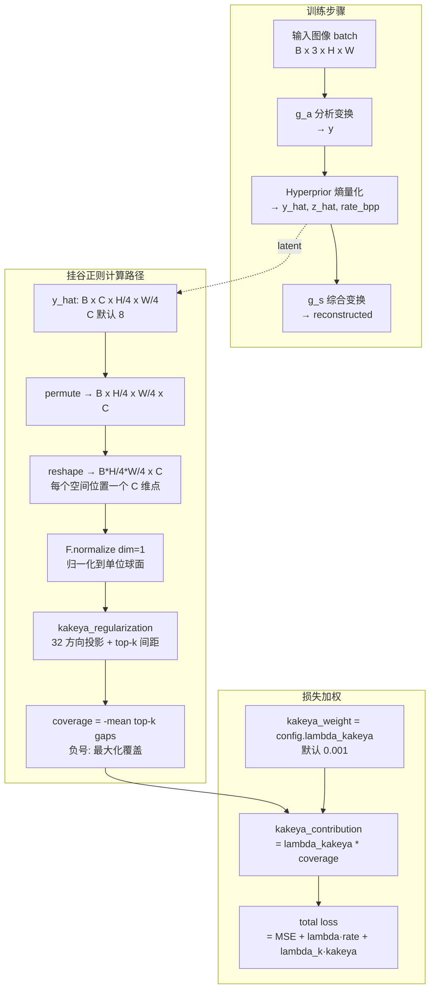

### 1.4 挂谷正则对潜空间的影响

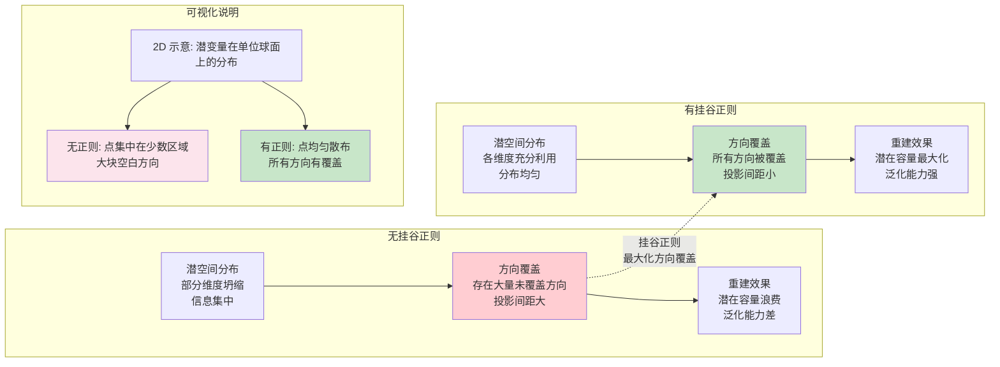

### 1.5 挂谷猜想 → 图像编解码 完整链路

```mermaid
flowchart TD
    subgraph 数学基础
        M1[Kakeya 猜想<br/>R^d 中包含所有方向线段<br/>的最小测度集合]
        M2[Besicovitch 构造<br/>测度可任意小<br/>但方向覆盖完备]
        M3[方向覆盖几何<br/>minimize volume<br/>maximize direction coverage]
        M1 --> M2
        M2 --> M3
    end

    subgraph 算法实现
        A1[潜变量点集<br/>latent → N x C 点<br/>L2 归一化到球面]
        A2[随机投影方向<br/>num_projections=32<br/>随机单位向量]
        A3[投影排序求间距<br/>sort → diff → top-k<br/>k=3]
        A4[覆盖损失<br/>-mean top-k gaps<br/>最大化最小间距]
        A1 --> A2
        A2 --> A3
        A3 --> A4
    end

    M3 -.->|方向覆盖思想| A2
    M3 -.->|最小化最大间距| A4

    subgraph 训练集成 (KakeyaHyperpriorCodec)
        T1[图像 → encoder → latent]
        T2[latent → 挂谷覆盖损失]
        T3[latent → decoder → 重建]
        T4[尺度条件总损失<br/>重建 + 高频 + 颜色 + λ·rate + λₖ·kakeya<br/>Capacity → Transition → Finetune]
        T1 --> T2
        T1 --> T3
        T2 --> T4
        T3 --> T4
    end

    A4 -.-> T2

    subgraph 最终效果
        F1[潜空间充分利用<br/>C 维方向覆盖更均匀]
        F2[目标: 提升重建质量<br/>在给定码率下提高信息利用率]
        F3[码率稳定<br/>熵编码效率优]
        F4[泛化能力强<br/>多尺度多内容]
        F1 --> F2
        F1 --> F3
        F1 --> F4
    end

    T4 -.-> F1

    style M3 fill:#fff9c4
    style A4 fill:#e1f5fe
    style T4 fill:#fff3e0
    style F1 fill:#c8e6c9
```


---

## 2. 模型结构 (KakeyaHyperpriorCodec — 超先验 + 挂谷正则)

```mermaid
graph TD
    subgraph INPUT["Input"]
        IMG[RGB Image<br/>H x W x 3]
    end

    subgraph BASE_STREAM["完整低频 Base 分支（无 InstanceNorm）"]
        IMG --> YCOCG[可逆 RGB → YCoCg<br/>保留 Y / Co / Cg]
        YCOCG --> CPOOL[Area Pool /8<br/>3×H/8×W/8]
        CPOOL --> BAE[Base Analysis<br/>3→4 幅度投影 + 两层残差细化]
        BAE --> CEB[Base EntropyBottleneck<br/>独立概率模型 p(y_base)]
        CEB --> BSD[Base Synthesis<br/>4→3 幅度投影 + 两层残差细化]
        BSD --> C_HAT[低频 Y / Co / Cg]
        C_HAT --> BUP[bilinear ×8<br/>解码低频参考]
    end

    subgraph ANALYSIS["g_a — Detail 分析变换"]
        YCOCG --> DSUB[有符号高频<br/>YCoCg - upsample Base]
        BUP --> DSUB
        DSUB --> HAAR[固定 Haar DWT /2<br/>3→12: LL/LH/HL/HH]
        HAAR --> P24[weight_norm Conv 3x3<br/>12→24]
        P24 --> BIN1[BlendedInstanceNorm<br/>初始 90% IN + 10% raw]
        BIN1 --> RB1[ResidualBlockGDN<br/>24]
        RB1 --> S2D2[SpaceToDepth<br/>24→32, /2]
        S2D2 --> BIN2[BlendedInstanceNorm]
        BIN2 --> RB2[ResidualBlockGDN<br/>32]
        RB2 --> CONV[weight_norm Conv 1x1<br/>32→64]
        CONV --> MS64[MultiScaleResidualBlock<br/>local 3x3 + dilated 3x3]
        MS64 --> SCH64[LightweightSCHBlock<br/>32 local + 32 window-channel<br/>4×4 windows, 4 heads]
        SCH64 --> RB64[ResidualBlockGDN<br/>64]
        RB64 --> PROJ[weight_norm Conv 1x1<br/>64→8]
        PROJ --> TANH[tanh bound ±5<br/>y: 8×H/4×W/4]
    end

    subgraph HYPER["超先验 Hyperprior"]
        TANH --> HA1[Conv 3x3 stride1<br/>8→8]
        HA1 --> HA2[Conv 5x5 stride2<br/>8, 下采样 /2]
        HA2 --> HA3[Conv 5x5 stride2<br/>8, 下采样 /2]
        HA3 --> EB[EntropyBottleneck<br/>8 通道]
        EB --> ATTN[Self-Attention<br/>16×16 → 256 tokens<br/>4 heads × 8-dim<br/>1×1 proj 8→32→8<br/>residual add]
        ATTN --> HD1[ConvTranspose 5x5 stride2<br/>8, 上采样 x2]
        HD1 --> HD2[ConvTranspose 5x5 stride2<br/>8, 上采样 x2]
        HD2 --> HD3[Conv 3x3<br/>8→16]
        HD3 --> H_SPLIT[按通道分为两组<br/>→ scale + mean]
    end

    subgraph CONDITIONAL["条件高斯熵模型"]
        TANH --> GC[GaussianConditional<br/>N(y_hat | mean, scale)]
        H_SPLIT -->|scale, mean| GC
        GC --> Y_HAT[y_hat<br/>量化潜变量]
        GC --> RATE[-log p(y_hat)<br/>空间自适应码率]
    end
    subgraph SYNTHESIS["g_s — Detail 综合变换"]

        Y_HAT --> D0[weight_norm Conv 3x3<br/>8→64]
        D0 --> DSCH[LightweightSCHBlock<br/>window-channel + local]
        DSCH --> DMS[MultiScaleResidualBlock<br/>local + context]
        DMS --> DRB64[ResidualBlockIGDN<br/>64]
        DRB64 --> D1[weight_norm Conv 3x3<br/>64→32]
        D1 --> DRB32[ResidualBlockIGDN<br/>32]
        DRB32 --> UPS[LearnedUpsample<br/>bilinear + sharp residual]
        UPS --> D2[weight_norm Conv 3x3<br/>32→24]
        D2 --> DRB24[ResidualBlockIGDN<br/>24]
        DRB24 --> DHEAD[Haar coefficient head<br/>24→12]
        DRB24 --> DREF[零初始化 coefficient refinement<br/>24→12]
        DHEAD --> IDWT[固定 Haar IDWT ×2<br/>12→3 YCoCg Detail]
        DREF --> IDWT
        IDWT --> DTANH[bound 2 × tanh<br/>有符号高频候选]
        C_HAT --> BASEUP[bilinear ×8<br/>绝对低频 YCoCg]
        DTANH --> CFUSE[expand Base + signed Detail]
        BASEUP --> CFUSE
        CFUSE --> INV[可逆 YCoCg → RGB]
        INV --> OUT[clamp RGB Output<br/>H x W x 3]
    end
    style INPUT fill:#e1f5fe
    style ANALYSIS fill:#f3e5f5
    style HYPER fill:#e8eaf6
    style CONDITIONAL fill:#fce4ec
    style SYNTHESIS fill:#e8f5e9
    style BASE_STREAM fill:#fff9c4
```

### 关键组件细节

```mermaid
graph LR
    subgraph SpaceToDepth
        A[Input] --> PU[PixelUnshuffle /2]
        PU --> C1[Conv]
        C1 --> BIN1[BlendedInstanceNorm]
    end

    subgraph FixedHaarBoundary
        B[3-channel Detail] --> DWT[固定 Haar DWT /2]
        DWT --> BANDS[12 channels<br/>LL/LH/HL/HH]
        BANDS --> IDWT[固定 Haar IDWT ×2]
        IDWT --> BR[3-channel Detail<br/>数值可逆]
    end

    subgraph BlendedInstanceNorm
        X[raw x] --> MIX[x + strength × IN x - x]
        X --> IN[InstanceNorm affine]
        IN --> MIX
        ALPHA[每通道 strength<br/>初始 0.9] --> MIX
    end

    subgraph MultiScaleResidualBlock
        M[Input] --> LOCAL[depthwise 3x3<br/>局部笔画]
        M --> CONTEXT[dilated 3x3<br/>版面上下文]
        LOCAL --> FUSE[concat + 1x1 Conv]
        CONTEXT --> FUSE
        FUSE --> RES[residual_scale 初始 0.1]
        M --> ADD[+]
        RES --> ADD
    end

    subgraph LearnedBaseBranch
        RGB[raw RGB] --> CO[可逆 YCoCg<br/>Y=(R+2G+B)/4]
        CO --> POOL[Area Pool /8]
        POOL --> BA[Base Analysis<br/>无 IN；3→4 latent]
        BA --> CODE[独立 EntropyBottleneck]
        CODE --> BS[Base Synthesis<br/>无 IN；4→3 YCoCg]
        BS --> REPLACE[替换全部低频 Y/Co/Cg<br/>Detail 高频保持不变]
    end

    subgraph DisjointDetailBranch
        SRC[full YCoCg] --> SUB[减去 upsample Base]
        SUB --> CODE_D[InstanceNorm/GDN Detail codec]
        CODE_D --> SIGNED[有符号 YCoCg residual]
        SIGNED --> COMPOSE[+ expanded decoded Base<br/>Laplacian pyramid synthesis]
    end

    subgraph LightweightSCH
        SX[64 channels] --> SPLIT_S[1×1 Conv + split]
        SPLIT_S --> LOCAL_S[32 local<br/>multi-scale depthwise Conv]
        SPLIT_S --> GLOBAL_S[32 window context<br/>4×4 window-channel attention]
        LOCAL_S --> FUSE_S[concat + 1×1 Conv]
        GLOBAL_S --> FUSE_S
        FUSE_S --> RES_S[residual scale 0.1]
        SX --> RES_S
    end
```

| 维度 | 说明 |
|---|---|
| 熵模型 | 独立因子分解 `p(z)·p(y_detail\|z)·p(y_base)`：EntropyBottleneck（z/Base）+ GaussianConditional（Detail） |
| 激活函数 | 分析侧 Residual GDN；合成侧 Residual IGDN |
| 归一化 | BlendedInstanceNorm，初始 90% IN + 10% 原始幅度路径 |
| 多尺度块 | 局部 3x3 与 dilation=2 分支融合 |
| 下采样 | Detail 边界固定 Haar DWT 2x + SpaceToDepth 2x = 4x |
| 上采样 | LearnedUpsample 2x + 固定 Haar IDWT 2x |
| SCH | 64 通道各放一个对称块；32 local + 32 window-channel，4×4 window / 4 heads；高清按 2048 windows 分块以限制峰值内存 |
| Detail 输入 | `YCoCg - upsample(low-frequency YCoCg)`；不再重复编码 Base |
| Detail 输出 | `2·tanh` 有符号 YCoCg 残差，直接与 expanded Base 相加；无 Sigmoid |
| Base 分支 | 完整低频 Y/Co/Cg、/8 采样、4 通道可学习 latent；无 IN，独立码流 |
| 损失函数 | MSE + edge + structural + multiscale + Laplacian + LAB + Base + Detail high-pass + λ·rate + λₖ·kakeya |
| h_s 增强 | Self-Attention；大图使用 16x16 窗口 |
| 潜空间 | 8 通道, ±5 bound, GaussianConditional 量化 |
| checkpoint | 架构版本 8，Kakeya Hyperprior v10 `[z,y_detail,y_base]`；明确不兼容旧架构 |
---

## 3. 损失函数组成

当前 KakeyaHyperpriorCodec 使用三阶段、尺度条件的重建与率失真损失：

```math
L = w_m·MSE + w_e·Edge + w_s·(1-SSIM) + w_{ms}·MultiL1
  + w_{hf}·Laplacian + w_l·ΔE + w_h·Hue + w_{sat}·Sat
  + w_b·BaseL1 + w_d·DetailL1
  + λₖ·Kakeya + λ·max(0, bpp - 2.5)
```

- MSE: 重建像素误差
- Edge: 梯度 L1 边缘损失
- Structural: 1 - SSIM 结构相似性
- Multiscale: 多尺度 L1（256/128/64 加权）
- Laplacian: 256 及以下启用的二阶高频损失
- LAB: CIELAB ΔE 色差 + 色相 + 饱和度
- BaseL1: `/8` 低频 Y/Co/Cg L1，约束绝对亮度、对比度和色度
- DetailL1: 去除 Base 后的有符号高频 Y/Co/Cg L1，直接监督文字与纹理
- Kakeya: 潜空间方向覆盖正则化
- Rate: 熵编码码率（`log2`），超出 2.5 bpp 的部分产生惩罚
- λ = 0.01（默认），λₖ = 0.001（默认）
- 各阶段权重由 `config.stage_weights()` 管理
- 256 及以下：rate ×0.35、edge ≥5、structural ≥1.2、multiscale ≤0.2
- 384 及以上：保持原阶段权重
---
---

---

## 4. 数据流 (Data Pipeline)

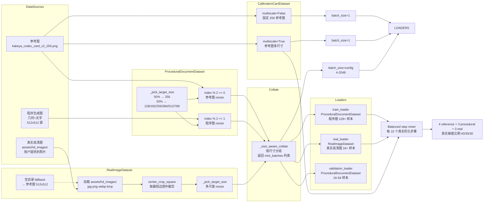

---

## 5. 训练流程 (train_image_codec / _hyperprior_epoch)

KakeyaHyperpriorCodec 使用 Capacity → Transition → Finetune 三阶段权重调度。
熵瓶颈 `quantiles` 只由辅助优化器更新，其他参数由 AdamW 更新；两组参数互斥，
每次更新前均执行有限性检查和梯度裁剪。

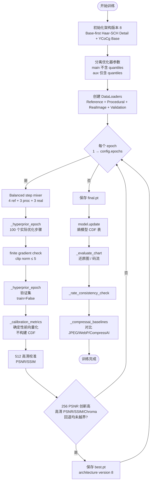

### 5.1 _hyperprior_epoch 细节

每个 epoch 对每个 DataLoader 批次执行：

1. `images = images.to(device)` — 数据迁移到 GPU/MPS
2. `reconstructed, y, _, y_hat, y_likelihoods, z_likelihoods = model(images)` — 前向传播
3. `loss_mse = F.mse_loss(reconstructed, images)` — 重建损失
4. `rate = (-log p(y_hat) - log p(z_hat)) / batch_size` — 熵编码码率
5. `bpp = rate / (H * W)` — 每像素比特
6. `coverage = kakeya_regularization(unit_normalized_latent, num_projections=32, k=3)` — 挂谷覆盖正则
7. 按尺寸选择小图条件权重或原高清权重
8. 计算 MSE、edge、SSIM、multiscale、Laplacian、LAB、Base、Detail high-pass、rate 与 Kakeya 总损失
9. `total.backward()` 后检查梯度有限性并裁剪到 5，再更新主参数
10. `aux_loss` 只更新 EntropyBottleneck 的 `quantiles`

---

## 6. 推理流程 (Web API / CLI)

```mermaid
flowchart TD
    UPLOAD([上传图片<br/>或 API 请求]) --> PARSE[解析图片<br/>PIL.Image RGB]

    PARSE --> SIZE_CHK{尺寸检查<br/>16-4096px}
    SIZE_CHK -->|过大| ERR1[400: 图片过大]
    SIZE_CHK -->|过小| ERR2[400: 图片过小]
    SIZE_CHK -->|OK| PAD[16 倍数边缘复制对齐<br/>保证 Base / Haar / SCH 网格一致]

    PAD --> LOAD_CKPT[加载 checkpoint<br/>要求 architecture version 8<br/>严格校验学习参数]
    LOAD_CKPT --> MODEL[KakeyaHyperpriorCodec<br/>eval mode]

    MODEL --> BASE_ENC[YCoCg /8 Base Analysis]
    BASE_ENC --> BCODE[Base EntropyBottleneck<br/>编码并解码 y_base]
    BCODE --> BASE_DEC[Base Synthesis<br/>decoded Base reference]
    MODEL --> DETAIL_SUB[YCoCg - expand decoded Base]
    BASE_DEC --> DETAIL_SUB
    DETAIL_SUB --> HAAR_ENC[固定 Haar DWT<br/>方向子带]
    HAAR_ENC --> ENCODE[y_detail = Haar-SCH encode(detail)]
    ENCODE --> MODEL_UPDATE[model.update<br/>熵模型 CDF 表]
    MODEL_UPDATE --> ZCODE[EntropyBottleneck<br/>compress/decompress z]
    ZCODE --> PARAMS[h_s + Attention<br/>生成 mean/scale]
    ENCODE --> YCODE[GaussianConditional<br/>条件编码 y]
    PARAMS --> YCODE
    YCODE --> RECONSTRUCT[IGDN + SCH<br/>预测 12 Haar coefficients]
    RECONSTRUCT --> HAAR_DEC[固定 Haar IDWT<br/>有符号 YCoCg Detail]
    HAAR_DEC --> CFUSE[expand Base + signed Detail]
    BASE_DEC --> CFUSE
    CFUSE --> CLAMP[YCoCg → RGB<br/>clamp 0, 1]

    CLAMP --> CROP[去除 padding<br/>恢复原始尺寸]
    CROP --> METRICS[计算真实 bytes / bpp<br/>PSNR / SSIM]
    METRICS --> RESP[返回重建图、误差图 + metrics]
```

### 6.1 训练前向与推理前向的关系

每个 epoch 对每个 DataLoader 批次执行：

1. `images = images.to(device)` — 数据迁移到 GPU/MPS
2. `reconstructed, y, _, y_hat, y_likelihoods, z_likelihoods = model(images)` — 训练时使用可微熵模型前向
3. `loss_mse = F.mse_loss(reconstructed, images)` — 重建损失
4. `rate = (-log2 p(y_hat) - log2 p(z_hat)) / batch_size` — 熵编码码率（bits）
5. `bpp_bits = rate / (H * W)` — 每像素比特
6. `rate_penalty = ReLU(bpp_bits - 2.5)` — 仅超出目标的码率产生惩罚
7. 感知损失：edge、structural、multiscale、Laplacian、lab、hue、saturation
8. `total = w_m·MSE + w_e·edge + w_s·structural + ... + λₖ·coverage + λ·rate_penalty` — 总损失
9. 主损失反向传播后检查有限性、裁剪梯度，再更新非 quantiles 参数
10. `aux_loss` 仅更新 EntropyBottleneck 的 quantiles

推理时不调用这段训练循环，而是先 `model.update()` 构建 CDF，再走
`compress → decompress` 的真实字节流路径。epoch 校准使用确定性模型前向，
不会在训练过程中反复重建 CDF。
---


---

## 8. Web API 端点结构

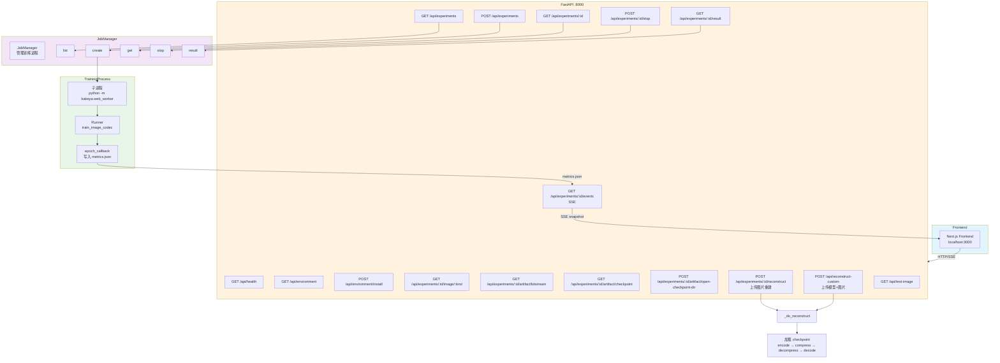

---

## 9. 泛化能力与高清大图处理

> 本节记录项目实际遇到的问题、诊断过程与优化方案。

### 9.1 泛化问题诊断

模型曾出现严重的过拟合——只学会重建 256² 参考图，对其他内容失效：

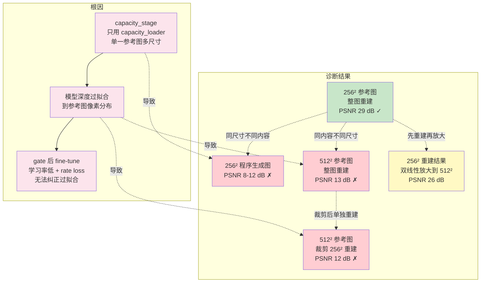

### 9.2 修复后的训练数据策略

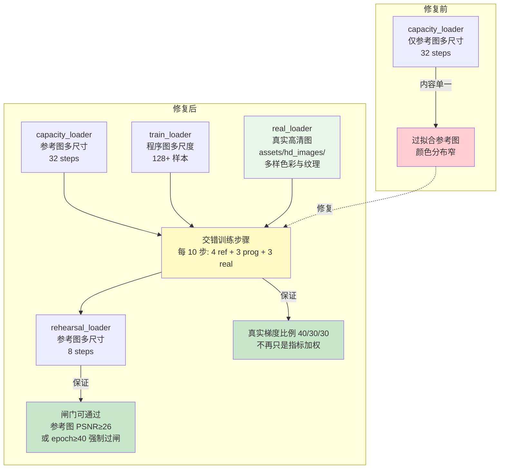

### 9.3 高清大图推理流程

推理时不切分图片、不缩放，整图通过模型（边缘复制 padding 到 16 的倍数；
SCH attention 内部按 window strip 分块限制临时内存）：

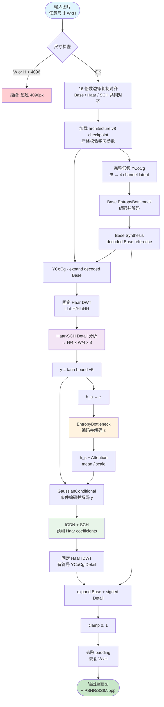

### 9.4 多尺度训练覆盖范围

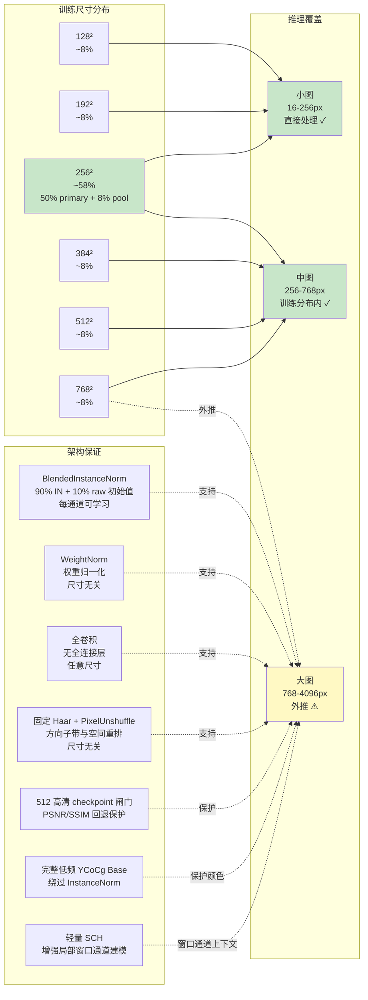

### 9.5 高清大图颜色与亮度问题

#### 当前方案：可学习的 Base / Detail 分解

架构 v8 先把 RGB 可逆转换为 YCoCg，再显式分解成 `/8` Base low-pass 和有符号
Detail high-pass。完整低频 Y/Co/Cg 由不含 InstanceNorm 的 Base Analysis /
Synthesis 编码为 4 通道潜变量；编码端先量化并重建 Base，Detail 编码器再接收
减去这个 decoded Base 后的残差，从而能在 Detail 中补偿 Base 量化误差，
不再为最终会被覆盖的低频重复付费。Detail 边界使用固定 Haar DWT/IDWT，把
LL/LH/HL/HH 方向子带交给网络学习；64 通道瓶颈使用轻量 SCH，把局部多尺度卷积
与 4×4 window-channel attention 融合。Detail 解码器预测 12 个 Haar coefficients，
经 IDWT 生成有符号 YCoCg 残差，不经过 Sigmoid。合成仍使用严格可逆的
Laplacian pyramid 形式 `expand(Base) + Detail`。

熵模型刻意保持为 `p(z)·p(y_detail|z)·p(y_base)`，没有引入联合上下文或串行
自回归依赖。`.kky` v10 使用 `[z,y_detail,y_base]` 三段；编码端 Base-first，解码端仍不需要
像素级串行自回归。项目以实验效果优先，架构版本提升到 8，旧 checkpoint 与 v9 bitstream
明确不兼容。Haar
不含可学习参数，SCH 只放在 H/4 的对称瓶颈，不把论文的 256/320 通道大模型或
5-slice 自回归熵模型照搬进当前项目。

训练数据通过 step mixer 按实际优化步骤执行 40% reference / 30% procedural /
30% real；checkpoint 除 PSNR/SSIM 外还保护高清 chroma MAE。

#### 9.5.1 历史诊断：过拟合导致颜色丢失

模型早期出现严重的过拟合问题——只学会重建 256² 参考图，对其他内容完全失效：

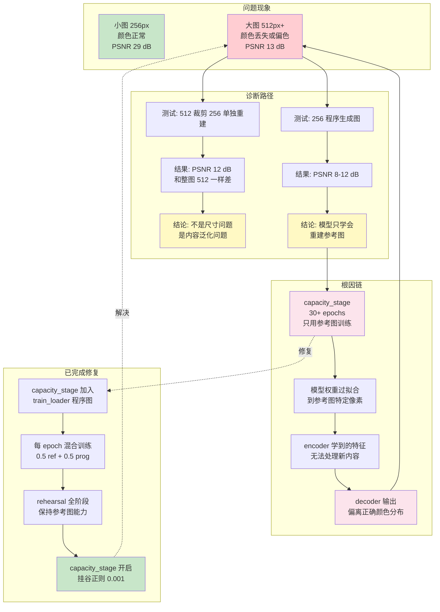

#### 9.5.2 失真问题的优化：分阶段损失调度

训练后期出现明显失真，根因是**部分损失项在后期才突然引入**——capacity/transition 阶段关闭 mse/structural，到 finetune 阶段才一次性启用，造成梯度方向突变、模型震荡。

**解决方案：所有损失方向全程参与，各阶段仅权重递增**——让模型从第一轮就在所有损失方向上学习，避免后期冷启动造成的梯度突变，各阶段通过权重递进调整侧重。权重统一由 `config.stage_weights()` 管理（[config.py](../src/kakeya/config.py) `DEFAULT_STAGE_WEIGHTS`），可在 YAML / API 覆盖。

| 阶段 | 损失权重 (config.stage_weights) | kakeya | 设计意图 |
|------|--------------------------------|--------|----------|
| Capacity | mse 3.0 / structural 0.1 / lab 0.02 | 0.002 | 专注方向覆盖，mse/structural/lab 用低权重做"种子" |
| Transition | mse 5.0 / structural 0.25 / lab 0.05 | 0.001 | 权重递增，感知约束逐步强化 |
| Finetune | mse 5.0 / structural 0.5 / lab 0.10 + rate | 0.0005 | 全部权重最高，协同优化码率与画质 |

```mermaid
flowchart TD
    subgraph 问题现象
        P1[训练后期失真明显<br/>细节模糊 / 色块 / 偏色]
        P2[损失曲线震荡<br/>损失项突然加入造成梯度突变]
    end

    subgraph 根因分析
        R1[部分损失项后期才启用]
        R2[capacity/transition 关闭 mse/structural<br/>finetune 一次性启用]
        R3[冷启动梯度方向<br/>与已学方向冲突]
        R1 --> R2 --> R3
    end

    subgraph 解决方案：所有损失全程参与，权重递增
        S1[Capacity: 全部损失参与<br/>mse 3.0 / structural 0.1 / lab 0.02<br/>kakeya 0.002]
        S2[Transition: 权重递增<br/>mse 5.0 / structural 0.25 / lab 0.05<br/>kakeya 0.001]
        S3[Finetune: 权重最高<br/>structural 0.5 / lab 0.10 + rate<br/>kakeya 0.0005]
        S1 --> S2 --> S3
    end

    subgraph 效果
        E1[无冷启动<br/>所有方向从早期学习]
        E2[过渡平滑<br/>权重递进避免梯度突变]
        E3[微调精细<br/>感知质量更优]
        E4[整体失真明显减少]
        E1 --> E2 --> E3 --> E4
    end

    P1 --> R1
    P2 --> R2
    S3 -.->|解决| P1
    S2 -.->|解决| P2

    style P1 fill:#ffcdd2
    style P2 fill:#ffcdd2
    style R1 fill:#fce4ec
    style S3 fill:#c8e6c9
```

#### 9.5.3 经验教训：损失函数 vs 数据质量

**核心结论：对于颜色还原问题，训练数据的多样性和覆盖面远比损失函数的精细调整重要。**

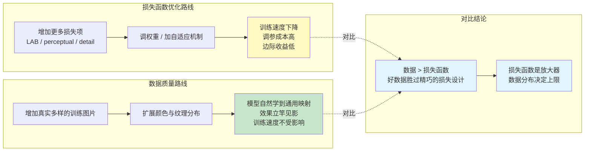

### 9.6 码率一致性检查 (rate consistency)

训练结束后验证多尺度码率稳定性：

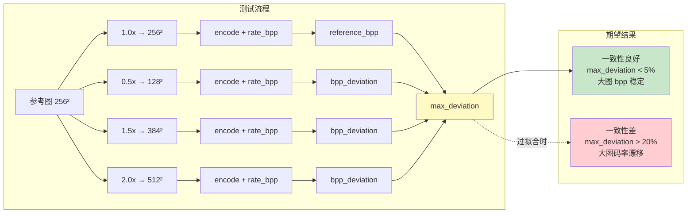
